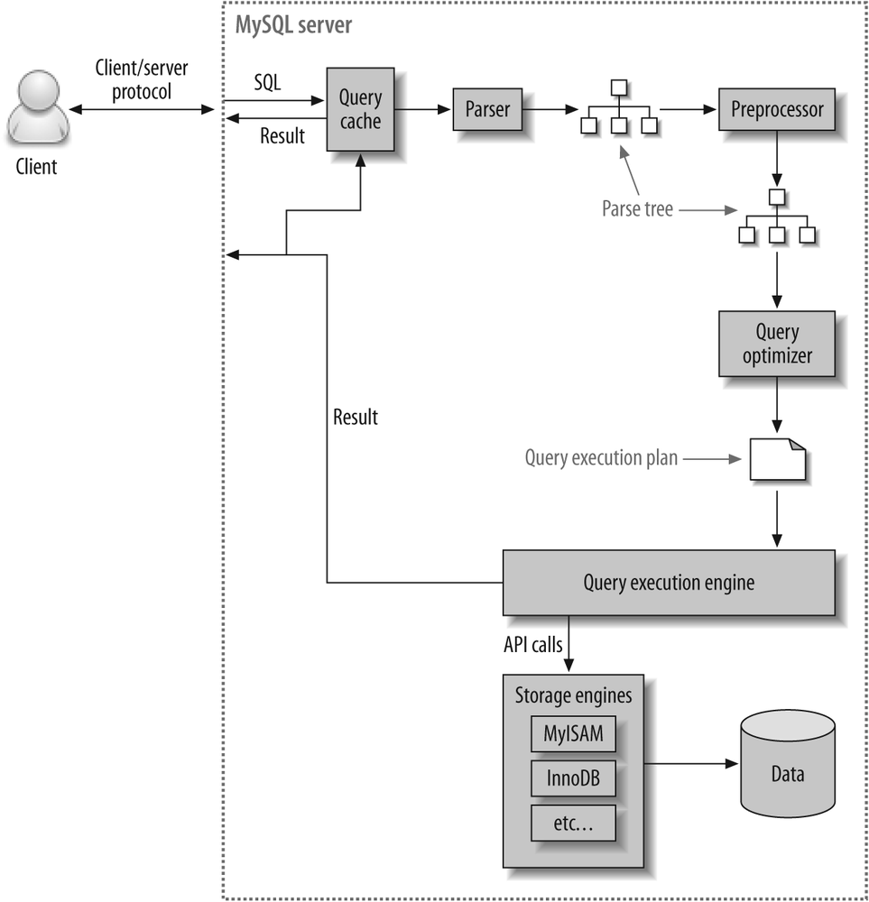

# MySQL 아키텍처

## 파서

* 쿼리 파서에는 어휘 스캐너와 문법규칙 모듈 두개로 이루어져 있다.
* 어휘 스캐너는 쿼리를 토큰으로 각각 분해하게 된다.
* 문법 규칙 모듈은 이 시퀀스를 생성하는 SQL 문법 규칙의 조합을 찾고 해당 규칙과 관련된 코드를 실행.
* 옵티마이저가 실행 할 수 있는 parse tree가 생성된다.

## 전처리기

* parse tree를 기반으로 문장 구조를 체크
* parse tree의 토큰이 유효한지 체크

## 옵티마이저

* SQL 실행을 최적화해서 실행 계획을 짬
* 규칙 기반 최적화 : 옵티마이저에 내장된 우선순위에 따라 실행 계획 수립
* 비용 기반 최적화 : 작업의 비용과 대상 테이블의 통계 정보를 활용해서 실행 계획 수립

## 스토리지 엔진

* 대표적으로 InnoDB , MyISAM 스토리지 엔진이있다.
* 플러그인 형태로 제공
* 검색어 parser , 사용자 인증 모듈 등도 플러그인 형태로 제공
* 플러그인끼리는 통신이 불가능
* mysql 서버의 변수나 함수를 직접 호출해서 캡슐화를 위반한다.

[출처](https://www.youtube.com/watch?v=vQFGBZemJLQ&t=646s)
[출처](https://velog.io/@suker80/MYSql%EC%97%90%EC%84%9C%EC%9D%98-%EC%BF%BC%EB%A6%AC-%EC%8B%A4%ED%96%89-%EA%B3%BC%EC%A0%95)
[출처](https://fourjae.tistory.com/entry/Database-Data-Page-Structure-SQL-%EC%84%9C%EB%B2%84%EA%B0%80-%EA%B0%96%EB%8A%94-%ED%8E%98%EC%9D%B4%EC%A7%80%EC%9D%98-%EA%B5%AC%EC%A1%B0)