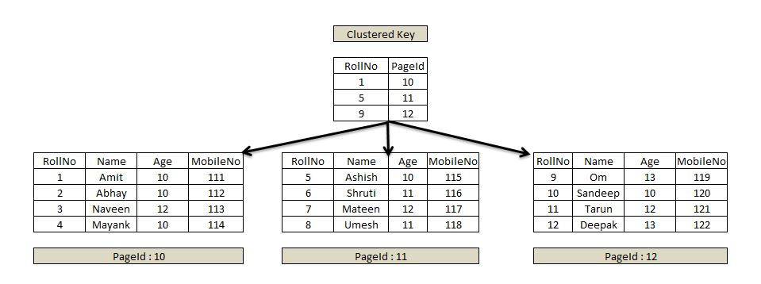

# 인덱스

인덱스란? 데이터베이스에서 검색 속도를 높이기 위해 사용하는 자료구조이다. 인덱스는 테이블의 컬럼에 대한 정렬된 데이터 구조로, 테이블의 검색 속도를 높이기 위해 사용된다.

## Clustred Index vs Non - Clustered Index

### Clustred Index (Primary Index)



* 인덱스 순서대로 데이터가 정렬
* 고로 테이블당 1개만 허용
* PK 설정시 해당 컬럼이 자동으로 클러스터드 인덱스로 설정
* 인덱스의 리프노드는 데이터다. 
* Index 클러스터 보다 속도는 빠르다. 하지만, 데이터의 삽입, 삭제, 수정이 빈번하게 일어날 경우 성능이 떨어진다.


* 행 데이터를 해당 열로 정렬한 이후에 `루트 페이지`를 만든다.
* Clustered Index는 루트 페이지와 리프 페이지로 구성되며, 리프 페이지는 데이터 그 자체이다.

### Non - Clustered Index (Secondary Index)


* 인덱스 순서대로 데이터가 정렬되지 않음
* 테이블당 여러개 생성 가능
* `Unique`로 설정된 컬럼은 자동으로 Non-Clustered 인덱스로 설정


* Non-Clustered Index는 데이터 페이지를 건드리지 않고, 별도의 장소에 인덱스 페이지를 생성한다.
* Non-Clustered Index의 인덱스 페이지는 키값(정렬하여 인덱스 페이지 구성)과 RID로 구성된다.
* 인덱스 페이지의 리프 페이지에 Index로 구성한 열을 정렬한 후 위치 포인터(RID)를 생성한다.


## Dense Index vs Sparse Index

### Dense Index

* 인덱스의 모든 키값이 데이터 레코드를 가리키는 포인터를 가지고 있어야 한다.(Dense는 빽빽하다는 뜻)

### Sparse Index

* 인덱스의 키값이 데이터 레코드를 가리키는 포인터를 가지고 있지 않는다.


* 장점은 인덱스의 크기가 작다.
* 단점은 인덱스를 탐색할 때 데이터 레코드를 찾기 위해 추가적인 탐색이 필요하다.
* Clustered Index의 경우 Sparse Index면 Block에 있는 가장 작은 값을 가지고 있다.
* Non-Clustered Index의 경우 Sparse Index면 Dense Index 블럭의 가장 작은 값을 가지고 있다.(아무래도 Non-Clustered Index는 데이터 페이지를 가지지 않기 때문에 모든 키를 가지는 것으로 보인다.)

## Multi Level Index

* 인덱스의 크기가 커지면 한번에 메모리에 올릴 수 없다.
* 이런 경우 인덱스를 여러개의 레벨로 나누어 저장한다.

* outer index : inner index를 가리키는 포인터를 가지고 있다.
* inner index : 데이터 레코드를 가리키는 포인터를 가지고 있다.


## Cardinality 란?

* Cardinality는 인덱스의 유일한 값의 수를 의미한다.
* Cardinality가 높을수록 인덱스의 효율이 높아진다.


## Selectivity 란?

* Selectivity는 인덱스의 유일한 값의 수와 전체 레코드의 수의 비율을 의미한다.
* Selectivity가 높을수록 인덱스의 효율이 높아진다.
* Carinality / 전체 레코드의 수


## 커버링 인덱스란?

* 커버링 인덱스란, 쿼리를 충족시키는데 필요한 모든 데이터를 갖고 있는 인덱스를 말함.


위와 같은 자료형이 있다고 가정하자.

```sql
explain
select *
from test2
where id = 333;
```

이런 쿼리를 실행한다면 실행 결과는 다음과 같이 나온다.


key에 나오듯이 index는 id를 사용하고 있지만, Extra에 아무것도 없다. 이는 인덱스를 사용했지만, 테이블을 조회해야 했기 때문이다.

```sql
explain
select id
from test2
where id = 333;
```


이번에는 id만 조회하는 쿼리를 실행했다. 이번에는 Extra에 Using index가 나온다. 이는 인덱스만으로 쿼리를 처리했기 때문이다.

```sql
CREATE INDEX idx_email_first_name ON test2(email, first_name);
```
위와 같은 인덱스를 생성했다고 가정하자. 이 때, 인덱스는 email, first_name을 순서대로 설정해야 효율적으로 작동한다.

```sql
explain
select 
	email, first_name
from 
	test2
where 
	first_name = 'Adrian';
```


Using where를 통해 데이터를 찾을 때, where 절의 조건을 사용했다고 할 수 있고, type이 index이므로 풀스캔을 했다는 것을 알 수 있다. 하지만, 디스크 I/O 없이 인덱스만을 사용한 것을 알 수 있다.


```sql
explain
select 
email, first_name
from test2
where email = 'amckeandrq@businessinsider.com'
and first_name = 'Adrian'
and id = 2;
```


복합인덱스와 포함되지 않는 컬럼으로 검색했으나
Extra 가 Using where 나 Using index 가 아닌 null 로 레코드를 직접 읽었다고 유추할 수 있음. 사용할 수 있는 키는 email, first_name이지만 사용한 것은 id를 사용하였다.

```sql
explain
select 
id, email, first_name
from test2
where email = 'amckeandrq@businessinsider.com'
and first_name = 'Adrian';
```


Extra 가 Using index 로 커버링 인덱스를 사용한 것을 알 수 있음.
분명히 인덱스는 email, first_name 만을 포함하며 id 는 포함하지 않았습니다.
그럼에도 불구하고 pk 인 id 를 포함하며 조회할 때에도 커버링 인덱스로 조회함.

[링크](https://velog.io/@sweet_sumin/%ED%81%B4%EB%9F%AC%EC%8A%A4%ED%84%B0%EB%93%9C-%EC%9D%B8%EB%8D%B1%EC%8A%A4-Clustered-Index-%EB%84%8C-%ED%81%B4%EB%9F%AC%EC%8A%A4%ED%84%B0%EB%93%9C-%EC%9D%B8%EB%8D%B1%EC%8A%A4-Non-Clustered-Index)

[링크](https://velog.io/@gillog/SQL-Clustered-Index-Non-Clustered-Index)

[디비 구조](https://fourjae.tistory.com/entry/Database-Data-Page-Structure-SQL-%EC%84%9C%EB%B2%84%EA%B0%80-%EA%B0%96%EB%8A%94-%ED%8E%98%EC%9D%B4%EC%A7%80%EC%9D%98-%EA%B5%AC%EC%A1%B0)

[디비 강의 자료](https://docs.google.com/presentation/d/1zmjHpc7cxuggwZNBNZ6QB_tWZSVF3G3e/edit#slide=id.p5)

[커버링 인덱스](https://tecoble.techcourse.co.kr/post/2021-10-12-covering-index/)

[커버링 인덱스](https://liltdevs.tistory.com/194)


## B Tree

## 트리

트리는 그래프의 일종으로 한 노드에서 시작해 다른 정점들을 순회해서 자기자신에게 돌아오는 순환이 없는 그래프


- 루트 노드
    - 가장 위에 있는 노드
- 브랜치 노드
    - 중간에 있는 노드
- 리프 노드
    - 마지막에 있는 노드

## B트리

데이터가 정렬된 상태로 유지되어 있는 트리로 이진트리와 비슷하지만 자식 노드는 2개 이상을 가질 수 있는 트리

1. **균일성: 어떤 값에 대해서도 같은 시간에 결과를 얻을 수 있다. → 이진트리와 비교해서 큰 장점**
2. 균형트리: 루트부터 리프까지 거리가 일정한 트리
3. 항상 정렬된 상태로 특정 값보다 크고 작고 부등호 연산에 문제가 없다.(B+ 트리에 해당)

## 이유?

1. hash나 이진 트리와 다르게 범위 연산이 가능하다는 장점이 존재 → b+트리만 해당
2. 디스크의 구조상 linked list 여러개 대신 연속되어있는 데이터를 선호함
3. 또한 깊이가 일정하게 유지가 되기 때문에 일정한 시간으로 데이터를 반환할 수 있다.

## B- 트리

[[DB] 10. B-Tree (B-트리)](https://rebro.kr/169)

최대 N개의 자식을 가질 수 있는 것이 N차 B-트리라고 부른다.

- 루트 노드는 리프 노드가 되지 않는 이상 적어도 2개 이상의 자식을 가진다.
- 브랜치 노드는 N개 부터 올림(N/2)개의 자식을 가진다.
- 노드의 키는 올림(N/2) - 1 개부터 N - 1개의 자식을 가질 수 있다.

[[자료구조] 그림으로 알아보는 B-Tree](https://velog.io/@emplam27/자료구조-그림으로-알아보는-B-Tree)

분할 과정이 잘 나와있다.

**삭제**

1. 삭제할 key가 리프노드에 있는 경우
2. 현재 노드의 key 수가 최소보다 큰 경우 단순히 삭제해도 무방
3. 현재 노드의 key 수가 최소이고, 왼쪽 또는 오른쪽 형제 노드의 key 수가 최소보다 큰 경우

**삽입**

1. 빈 트리일 경우 root node를 만들어 삽입한다. root node가 가득 찬 경우 노드를 분할하여 리프노드를 생성.
2. key가 들어갈 리프노드를 탐색한다.
3. 해당 리프 노드에 자리가 남아있다면 정렬을 유지하도록 알맞은 위치에 삽입하고, 리프 노드가 꽉 차 있다면 key를 삽입 후 해당 노드를 분할한다.
4. 노드가 분할되는 경우 노드의 중앙값을 기준으로 분할한다. 중앙값은 부모 노드로 합쳐지거나 새로운 노드로 생성되고, 중앙값을 기준으로 왼쪽의 키는 왼쪽 자식, 오른쪽의 키는 오른쪽 자식으로 생성된다.

## B*트리

최대 N개의 자식을 가질 수 있는 것이 N차 B*트리라고 부른다.

- b+트리의 응용편
- 브랜치 노드는 N개에서 올림(2N/3)개의 자식을 가진다.
- 노드가 가득차면 분열대신 형제 노드로 간다.

## B+ 트리

[[DB] 11. 인덱스(Index) - (1) 개념, 장단점, B+Tree 등](https://rebro.kr/167)

- b-트리는 탐색을 위해 노드를 찾아 나서는 단점이 존재
- 이를 해결하고자 B+ 트리는 같은 레벨 모든 키 값들이 정렬되어있고, 같은 레벨의 sibling node는 연결리스트 형태로 이어져 있음
- 또한, 리프노드에만 데이터가 존재한다. 브랜치와 루트 노드는 인덱스 역할만 해준다.\
- 하지만 데이터에 접근하기 위해 무조건 logn을 거쳐야함
- 그래도 데이터 탐색시에 선형 탐색이 가능해서 인덱스의 자료구조로 쓰임