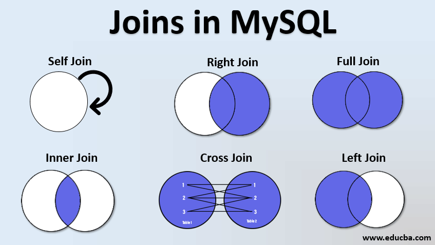
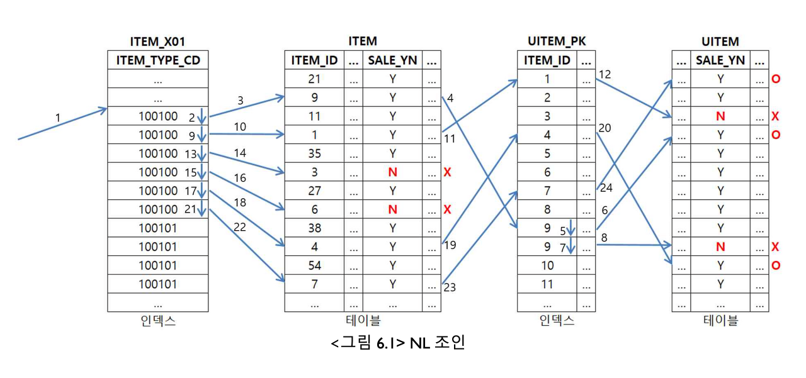
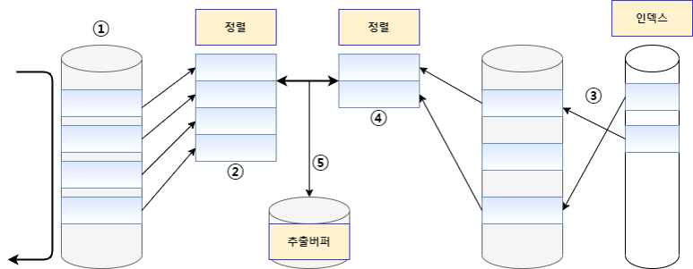
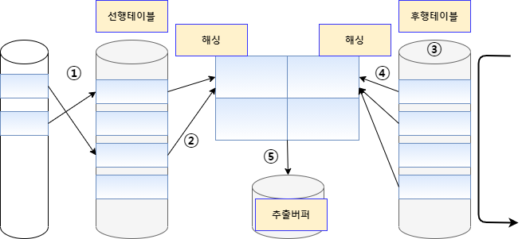

# Join

## 물리적 조인 vs 논리적 조인

* 논리적 조인은 inner join, outer join같이 사용자가 SQL문을 작성할 때 사용하는 조인이다.
* 물리적 조인은 논리적 조인을 실제로 어떻게 구현할 것인지를 결정하는 것이다.


## 논리적 조인



### Inner Join

* 두 테이블에서 공통되게 존재하는 컬럼을 기준으로 두 테이블을 합친다.

### Outer Join

* Inner Join과 다르게 존재하지 않는 데이터도 합친다. 이 때 만약에 해당 데이터가 없다면 NULL로 표시한다.

## 물리적 조인

### Nested Loop Join

## NL Join (Aka. nested loop join)

→ block nested join 있음

- 한마디로 for 문을 돌려서 Join을 하는 방식

1. 선행 테이블에서 만족하는 첫 번째 행을 스캔
2. 선행 테이블의 조인 키를 가지고 후행 테이블에 키가 존재하는지 스캔
3. 후행 테이블의 인덱스에 선행 테이블의 조인 키가 존재하는지 확인
    1. 2번에서 데이터가 나오지 않는다면 그냥 선행 테이블만 필터링 진행
4. 인덱스에서 추출한 레코드 식별자를 이용하여 후행 테이블에 엑세스
    1. 조건을 따져서 필터링

#### 코드예시

```sql
SELECT   /*+ USE_NL (B) */
        A.*
      , B.*
FROM    ITEM A, UITEM B
WHERE A.ITEM_ID=B.ITEM_ID --- 1
AND A.ITEM_TYPE_CD = '100100' --- 2
AND A.SALE_YN = 'Y'  --- 3
AND B.SALE_YN = 'Y'  --- 4

```

동작순서 : 2 -> 3 -> 1 -> 4




- 절차적이며, 프로그래밍에서 FOR, WHILE문 과 같은 구조로 수행된다.
- 선행테이블은 풀스캔하므로, 선행테이블의 크기가 작을수록 유리하다

    (So. 두 테이블의 크기 차이가 있는 경우, 유리하게 사용될 수 있는 방법임)

- 후행테이블에 대해서는 반드시 인덱스가 존재해야 NL 조인이 가능하다.
- 인덱스 구성 전략이 특히 중요하다. 선행 테이블을 풀스캔하므로, 조인 컬럼에 대한 인덱스가 있느냐 없느냐, 있다면 컬럼이 어떻게 구성됐느냐에 따라 조인 효율이 크게 달라진다.
- 랜덤 액세스 방식으로 데이터를 읽는다.-> 처리 범위가 좁은 것이 유리하다.

이런 여러가지 특징을 종합할 때, NL 조인은 소량의 데이터를 주로 처리하거나 부분범위처리가 가능한 온라인 트랜잭션 환경에 적합한 조인 방식이라고 할 수 있다.

### Sort Merge Join

일반적으로 대량의 조인 작업에서 정렬 작업을 필요로 하는 Sort Merge Join 보다는 CPU 작업 위주로 처리하는 Hash Join이 성능상 유리합니다. 그러나 Sort Merge Join은 Hash Join 과는 달리 동등 조인뿐만 아니라 비동등 조인에 대해서도 조인 작업이 가능하다는 장점이 있습니다.



1. 선행 테이블에서 주어진 조건을 만족하는 행을 찾음
2. 선행 테이블의 조인 키를 기준으로 정렬작업을 수행
- 1 ~ 2번 작업을 선행 테이블의 조건을 만족하는 모든 행에 대해 반복 수행
1. 후행 테이블에서 주어진 조건을 만족하는 행을 찾음
2. 후행 테이블의 조인 키를 기준으로 정렬 작업을 수행
- 3 ~ 4번 작업을 후행 테이블의 조건을 만족하는 모든 행에 대해 반복 수행
1. 정렬된 결과를 이용하여 조인을 수행하며 조인에 성공하면 추출버퍼에 넣음

#### 코드예시

```sql
SELECT  /*+ ORDERED USE_MERGE(B) */
        A.*
      , B.*
FROM  ITEM A, UITEM B
WHERE A.ITEM_ID=B.ITEM_ID   -- 1
AND A.ITEM_TYPE_CD = '100101'   -- 2
AND A.SALE_YN = 'Y'  -- 3
AND B.SALE_YN = 'Y'  -- 4
```

동작 순서 2 -> 3 -> 4 -> 1

- 인덱스가 없어도 가능한 조인법
- 대부분 해시조인인 보다 느린 성능을 보이나, 아래와 같은 상황에서는 소트머지 조인이 유용하다.
    - 선행 테이블에 소트연산을 대체할 인덱스가 있을 때
    - 조인할 선행 집합이 이미 정렬되어 있을 때
    - 조인 조건식이 등차(=)조건이 아닐 때
    - 두 테이블의 사이즈가 비슷한경우에 유리하며, 사이즈 차이가 큰 경우에는 불리하고, 비효율적인 방법이다.

### Hash Join



조인될 두 테이블 중 하나를 해시 테이블로 선정하여 조인될 테이블의 조인 키 값을 Hash 알고리즘으로 비교하여 매치되는 결과값을 얻는 방식.

1. 선행 테이블에서 주어진 조건을 만족하는 행을 찾음
2. 선행 테이블의 조인 키를 기준으로 해시함수를 적용하여 해시 테이블을 생성 -> 조인 컬럼과 SELECT 절에서 필요로 하는 컬럼도 함께 저장
    - 1 ~ 2번 작업을 선행 테이블의 조건을 만족하는 모든 행에 대해 반복 수행
3. 후행 테이블에서 주어진 조건을 만족하는 행을 찾음
4. 후행 테이블의 조인 키를 기준으로 해시 함수를 적용하여 해당 버킷을 찾음 -> 조인 키를 이용해서 실제 조인될 데이터를 찾음
5. 조인에 성공하면 추출버퍼에 넣음
    - 3 ~ 5번 작업을 후행 테이블의 조건을 만족하는 모든 행에 대해 반복 수행

### 특징

1. 조인 칼럼의 인덱스를 사용하지 않기 때문에 조인 칼럼의 인덱스가 존재하지 않을 경우데도 사용할 수 있는 기법이다.
2. 메모리 사용이 큰 대용량 테이블 조인시 메모리 외에 임시영역(PGA 메모리)까지 사용하여 저장할 수 있어 유리함
3. 근데 해쉬버킷 쓰니까 메모리….
4. 해쉬 함수를 이용하여 조인을 수행하기 때문에 '='로 수행하는 조인에서만 사용가능 합니다.
5. 처음 테이블이 빌드 테이블, 나중 테이블이 프로프라고 하자
6. 이 때, 빌드 테이블 크기가 작아야 메모리가 작다고 한다. 아마… 해쉬 버킷 크기를 작게 하려는 듯?
7. 만약에 index를 통해 후행 접근하려면 nlogn이 되기 때문에 풀스캔으로 랜덤 엑세스를 하는게 좋다. (빌드 테이블을 이미 돌고나서 프로브 테이블에서 빌드 테이블과 같은 키값을 찾아서 넣어주면 되기 때문)


## mysql 버전별로 조인 종류


