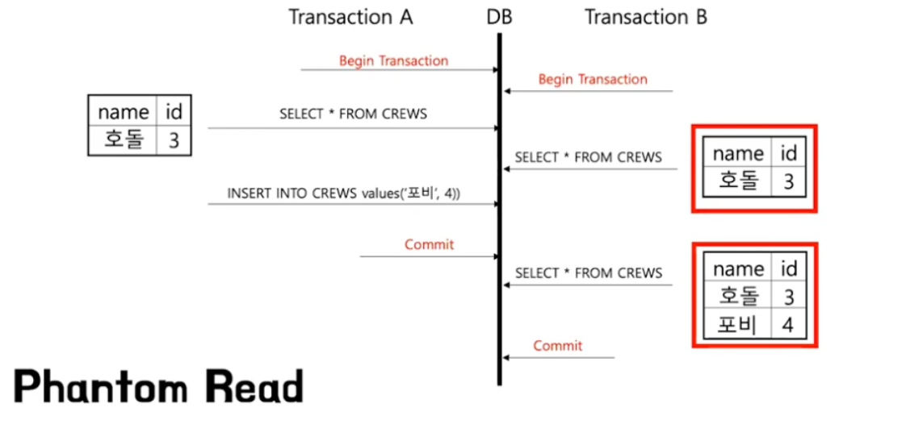

# 트랜잭션

트랜잭션은 여러 쿼리를 논리적으로 하나의 작업으로 묶어주는 것을 말한다. 데이터베이스에 저장된 데이터베이스의 무결성과 동시성의 성능을 지키기 위해 트랜잭션의 설정이 중요하다.

## 트랜잭션 격리수준

### 트랜잭션 격리 수준(Transaction Isolation Level)

트랜색션이 얼마나 고립 되어있는지 알려줌

- READ UNCOMMITTED : `커밋 전` 트랙잭션의 변경을 다른 트랜잭션이 읽는 것을 허용
- READ COMMITTED : `커밋이 완료`된 데이터만 다른 트랜잭션에서 조회가능
- REPEATABLE READ : 트랜잭션 범위 내에서 조회한 내용은 항상 동일함을 보장
- SERIALIZABLE : 한 트랜잭션이 사용하는 데이터를 다른 트랜잭션이 접근 불가

3가지 이상

dirty read, non-repeatable read,panthom read

**READ UNCOMMITTED**

어떤 트랜잭션의 변경내용이 COMMIT이나 ROLLBACK과 상관없이 다른 트랜잭션에서 보여진다.

**문제점 : dirty Read**

커밋되지 않은 데이터를 read하는 것을 말한다.

예를 들어, A 트랜잭션에서 1번의 사원 이름 변경하고 커밋하지 않았을 경우에도, B 트랜잭션에서 1번 사원의 이름을 조회하면 변경된 이름으로 조회된다. 이것을 `dirty Read`라고 한다. 트랜잭션 A가 커밋 하지 않았음에도 트랜잭션 B는 무효된 값을 읽고 처리할 가능성이 생긴다.

**READ COMMITTED**

어떤 트랜잭션의 `변경 내용이 COMMIT` 되어야만 다른 트랜잭션에서 조회할 수 있다. 오라클 DBMS에서 기본으로 사용하고 있고, 온라인 서비스에서 가장 많이 선택되는 격리수준이다.

**문제점 : NON-REPETABLE READ**

같은 트랜잭션 내에서 READ시 값이 다르게 나오는 데이터 불일치 문제이다. 즉, 하나의 트랜잭션에서 동일한 쿼리를 두 번 이상 수행할 때, 동일한 쿼리임에도 다른 결과를 얻는 문제점이다. (update 시)

`REPEATABLE READ` 정합성 : `하나의 트랜잭션 내`에서 똑같은 SELECT를 수행했을 경우 `항상 같은 결과를 반환`해야 한다는 것에 어긋난다.

예를 들어, 오늘의 입금 총 합을 보여주는 트랜잭션이 있다면, 총합을 계산하는 select 쿼리는 실행될 때 마다 다른 결과 값을 가져온다는 것을 말한다.

**REPEATABLE READ →** 

트랜잭션이 `시작되기 전에 커밋된 내용`에 대해서만 조회할 수 있는 격리수준이다. 즉, 자신의 트랜잭션 번호보다 `낮은 트랜잭션 번호` 에서 커밋한 내용만 볼 수 있다. MySQL DBMS에서 기본으로 사용하고 있고, 이 격리수준에서는 NON-REPETABLE READ 의 한 종류인 `Phantom Read`가 발생한다.

**문제점 : Phantom Read**

하나의 트랜잭션 내에서 일점범위의 레코드를 두 번 이상 읽을 때, 똑같은 쿼리임에도 첫번째 쿼리에 없던 레코드가 두번째 쿼리에서 나타나는 현상이다.(insert를 할 때)

**SERIALIZABLE**

가장 단순하고 엄격한 격리 수준이다. 격리수준이 SERIALIZABLE일 경우 읽기 작업에도 `공유 잠금`을 설정하게 되고, 이러면 동시에 다른 트랜잭션에서 이 레코드를 변경하지 못하게 된다. 이러한 특성 때문에 동시처리 능력이 다른 격리수준보다 떨어지고, 성능저하가 발생하게 된다.