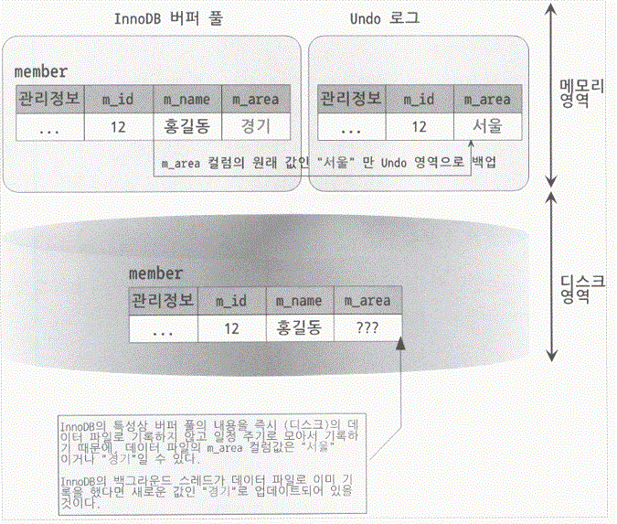

# 장애 복구 과정, 영속화 과정

## 체크 포인트란?

특정한 경우에서 어느 한 SCN 시점에서 DBWR이
DB Buffer Cache에 있는 내용들을 해당 데이터 파일들에
모두 기록하는 이벤트를 Checkpoint 라고 한다

### 발생 조건

* 로그 스위치가 발생할 경우
* 3초마다 발생
* 테이블 스페이스가 오프라인으로 변경될 경우
* 데이터베이스가 정상 종료될 경우
* 사용자가 ALTER SYSTEM CHECKPOINT 명령으로 명시적인 체크포인트를 발생시킬 경우
* 체크포인트 관련 파라메터에서 정한값에 의해 활동 주기가 되었을 경우

## 데이터 베이스 구조

## redo

(3번에서 Redo Log라고 해야한다. Buffer라고 오타남)

MySQL 구조상 Buffer에 값을 기록하고 일정 시간이 지나야 디스크에 기록된다. 이때, Buffer에 기록된 데이터가 디스크에 기록되기 전에 DB가 셧다운되면 Buffer에 기록된 데이터는 사라진다. 이를 방지하기 위해 Redo Log를 사용한다. Redo Log는 Buffer에 기록된 데이터를 디스크에 기록하기 전에 Redo Log에 기록한다. 따라서, DB가 셧다운되어도 Redo Log에 기록된 데이터를 디스크에 기록함으로써 데이터 손실을 방지한다.

Redo Log 파일은 두 개의 파일로 구성된다. 하나의 파일이 가득차면 log switch 가 발생하면서 다른 파일에 쓰게 된다. log switch가 발생할 때 마다 checkpoint가 발생한다. 이 때, InnoDB Buffer Pool에 있는 데이터가 디스크에 기록된다.

## undo

실행 취소 로그 레코드의 집합으로 트랜잭션 실행 후 Rollback 시 Undo Log를 참조해 이전 데이터로 복구할 수 있도록 로깅 해놓은 영역이다.

* Undo Log는 트랜잭션의 실행 전 상태를 저장한다.
* 트랜잭션 실행 후 Rollback 시 Undo Log를 참조해 이전 데이터로 복구할 수 있도록 로깅 해놓은 영역이다. 

[참고](https://velog.io/@max019258/%EC%B2%B4%ED%81%AC%ED%8F%AC%EC%9D%B8%ED%8A%B8%EC%99%80-SCN)

[참고](https://loosie.tistory.com/527)

[참고](https://engineerinsight.tistory.com/181#%F0%9F%92%8B%20%EC%96%B8%EB%91%90%20%EB%A1%9C%EA%B7%B8(Undo%20log)-1)