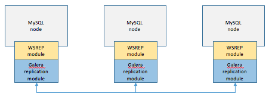

# 레플리케이션, 샤딩, 파티셔닝

## 레플리케이션

* 두 개의 이상의 DBMS 시스템을 Mater / Slave로 나눠서 동일한 데이터를 저장하는 방식이다.
* 비동기적으로 데이터를 복제한다.
* Master에 쓰기 요청이 들어오면 Master는 Slave에게 데이터를 복제한다.
* Master는 쓰기 연산을 하고, Slave는 읽기 연산을 한다.
* 노드들 간의 데이터 동기화가 보장되지 않아 일관성있는 데이터를 얻지 못할 수 있다.
* 리플리케이션은 Master와 Slave간의 데이터 무결성 검사(데이터가 일치하는지)를 하지 않는 비동기방식으로 데이터를 동기화한다. 

### 작동 방식

위의 그림은 MySQL의 Replication 방식에 대한 그림이며 자세한 처리 순서는 아래와 같다.
 

1. Master 노드에 쓰기 트랜잭션이 수행된다.
2. Master 노드는 데이터를 저장하고 트랜잭션에 대한 로그를 파일에 기록한다.(BIN LOG)
3. Slave 노드의 IO Thread는 Master 노드의 로그 파일(BIN LOG)를 파일(Replay Log)에 복사한다.
4. Slave 노드의 SQL Thread는 파일(Replay Log)를 한 줄씩 읽으며 데이터를 저장한다.

## 클러스터링

클러스터링이란 여러 개의 DB를 수평적인 구조로 구축하는 방식이다.클러스터링은 분산 환경을 구성하여 Single point of failure와 같은 문제를 해결할 수 있는 Fail Over 시스템을 구축하기 위해서 사용된다.

* 노드들 간의 데이터를 동기화하여 항상 일관성있는 데이터를 얻을 수 있다.
* 1개의 노드가 죽어도 다른 노드가 살아 있어 시스템을 계속 장애없이 운영할 수 있다.
* 여러 노드들 간의 데이터를 동기화하는 시간이 필요하므로 Replication에 비해 쓰기 성능이 떨어진다.
* 장애가 전파된 경우 처리가 까다로우며, 데이터 동기화에 의해 스케일링에 한계가 있다.

### 작동 방식

1. 1개의 노드에 쓰기 트랜잭션이 수행되고, COMMIT을 실행한다.
2. 실제 디스크에 내용을 쓰기 전에 다른 노드로 데이터의 복제를 요청한다.
3. 다른 노드에서 복제 요청을 수락했다는 신호(OK)를 보내고, 디스크에 쓰기를 시작한다.
4. 다른 노드로부터 신호(OK)를 받으면 실제 디스크에 데이터를 저장한다.

## 샤딩

데이터 베이스 테이블을 수평적으로 분할하는 방식이다. 샤딩은 데이터 베이스의 크기가 커지면서 발생하는 성능 저하를 해결하기 위해 사용된다. 서로 다른 노드에 데이터를 분산하여 저장한다.

### Range
컬럼값으로 샤드를 지정하는 방식이다. Hash Shard 대비 증설작업에 리소스 소요가 적다. 따라서 데이터가 **급격히 증가하는 경우 사용하면 좋다. 하지만, 특정 데이터베이스에 부하**가 몰리는 경우가 생긴다.

### Hash(Key)
Hash 함수를 통해 반환되는 값으로 샤드를 결정하는 방법이다. 일반적으로 나머지값인 Modular를 사용한다. 샤드(분산 DB)수가 정해진 경우 사용하기 좋다. DB 수가 변경되면 재정렬이 필요하다.

### Dynamic
Locator Service를 통해 shard를 나눈다. DB수가 변경되어도 Locator Service에 샤드키만 추가하면 되기때문에 확장에 유연하다.

### GEO
데이터의 지리적 위치에 따라 가까운 서버에 분할한다. 한국이면 한국 샤드에, 미국이면 미국 샤드에 저장.

## 파티셔닝

하나의 테이블을 여러개의 테이블로 물리적으로 분할 저장하는 방법. 사용자는 논리적으로 하나의 테이블을 사용하는 것과 같이 사용 가능하다. (같은 데이터 베이스 내부에서 테이블을 나누는 방식)

[참고](https://mangkyu.tistory.com/97)
[참고](https://velog.io/@goseungwon/%ED%8C%8C%ED%8B%B0%EC%85%94%EB%8B%9D%EA%B3%BC-%EC%83%A4%EB%94%A9)