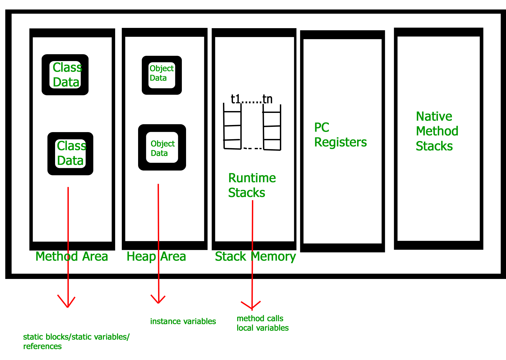
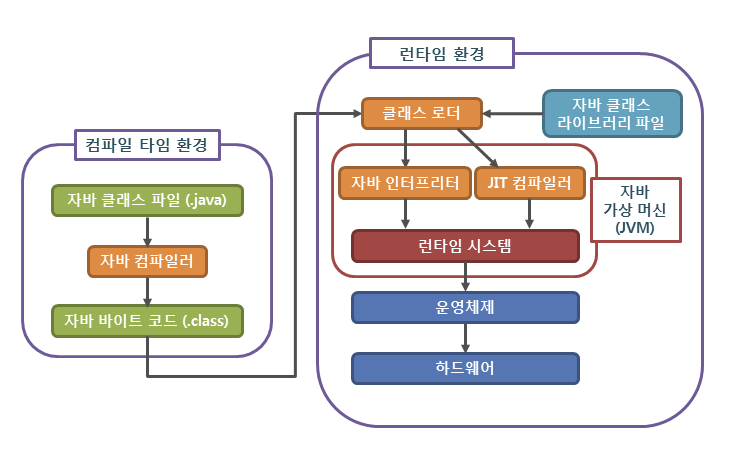

JVM internals (Classloaders, JIT, GC Algorithms, 자바 컴파일 과정)

## JVM

- 컴퓨터가 Java 바이트코드로 컴파일된 컴퓨터 언어로 작성된 프로그램을 실행할 수 있게 해주는 가상머신
- 플랫폼에 독립적인 실행 환경을 제공합니다.
- 컴퓨터 언어 → Java ByteCode Compllie → JVM 실행 

### 역할

- 플랫폼 독립성 제공: 어느 운영체제에서도 자바 프로그램이 동일하게 실행될 수 있게 한다.
- 메모리 관리: GC를 활용해서 메모리 관리를 한다.
- 실행 환경 제공: 런타임을 제공함.

## Classloaders


### Classloader 종류


- Bootstrap Classloader
    - 최상위 클래스로, JVM이 시작할 때 가장 먼저 클래스를 로드하는 클래스로, JAVA_HOME/jre/lib/rt.jar에 있는 클래스를 로드한다.

- Extension Classloader
    - JAVA_HOME/jre/lib/ext/*.jar에 있는 클래스를 로드한다.
    - 사용자가 만든 클래스를 로드할 수 없다.

- Application Classloader
    - 사용자가 만든 클래스를 로드한다.
    - Classpath 환경 변수에 지정된 디렉토리나 jar 파일을 클래스로더가 로드한다.


**위임이라는 것은 일종의 필터 체인 같은 느낌이다. 계속 부모 클래스 로더로 요청을 보내고 부모 클래스로더로 부터 해당 클래스가 있는지 찾아나선다.**


### Classloader 서브 시스템

- Loading
    - 클래스 로더가 .class 파일을 읽고 해당 바이너리 데이터를 생성하여 메서드 영역에 저장.
        - 바로 위 부모 클래스와 현재 클래스의 정규화된 이름
        - 클래스, 인터페이스, Enum여부
        - Modifier, 변수, 메서드 정보
- Linking
    - Verify, Prepare, Resolve
        - Verify: `.class` 파일의 정확성 보장하기. → 작업이 완료되면 컴파일 할 준비를 합니다.
        - Prepare: 클래스가 필요로 하는 메모리를 할당하고, 클래스에서 정의된 필드, 메소드, 인터페이스를 나타내는 데이터 구조를 준비한다.
        - 분석(resolve): 심볼릭 메모리 레퍼런스를 메소드 영역에 있는 실제 레퍼런스로 교체한다.
- 초기화(Initialization)
    - 클래스 변수들(static 변수)을 적절한 값으로 초기화한다. 즉, static 필드들이 설정된 값으로 초기화된다.
    - 클래스 생성자를 호출한다.

## JVM 메모리 구조



### Method Area

* static 변수를 포함해서 클래스 이름, 부모 클래스 이름, 메서드 정보 등... 모든 클래스 레벨 정보가 저장되는 곳
* 모든 스레드가 공유하는 영역

#### Constant Pool

* 클래스 파일의 상수들을 저장하는 공간
* Constant는 상수만을 의미하는 것이 아니라 Literal Constant, Type Field(Local Variable, Class Variable), Method로의 모든 Symbolic Reference를 의미.
* 메서드 바이트 코드나 정적 필드는 이곳에 저장되지 않는다.
* 상수 자료형을 저장하여 참조하고 중복을 막는 역할을 수행한다.

```java
cp_info {
    u1 tag; // 태그
    u1 info[]; // 값
}
/* tag는 1바이트 숫자로 구성되며 JVM에게 아래와 같은 타입을 제공합니다.
Utf8: 1
Integer: 3 (* Boolean, Short, Byte도 여기에 해당됨)
Float: 4
Long: 5
Double: 6
Class reference: 7
String reference: 8
*/
```


[링크](https://docs.oracle.com/javase/specs/jvms/se8/html/jvms-2.html#jvms-2.5.5)

[링크](https://imbf.github.io/interview/2021/03/02/NAVER-Practical-Interview-Preparation-4.html)

### Heap

* 모든 객체가 저장되는 공간
* 모든 스레드가 공유하는 영역
* new로 생성되면 전부 여기에 저장된다.
* 영역이 존재해 각각 영역마다 GC가 다르게 동작한다.

### Stack

* 메서드 호출 시 마다 각각의 스레드마다 생성되는 공간
* 메서드 정보, 지역 변수, 매개변수, 리턴 값 등이 저장된다.
* 메서드에서 객체를 생성하면 그 객체의 참조값이 스택에 저장된다.
* 각 스레드마다 생성된다.

### PC Register

* 현재 실행중인 JVM 명령의 주소를 저장하는 공간
* 각 스레드마다 생성된다.

### Native Method Stack

* 자바 외의 언어로 작성된 네이티브 코드를 위한 공간
* 각 스레드마다 생성된다.

## 실행엔진 

### JIT(Just-In-Time) 컴파일러




- 인터프리터 방식의 단점을 보완하기 위해 도입된 컴파일러
- 실행 중 반복되는 코드를 발견하면 JIT 컴파일러가 해당 코드를 네이티브 코드로 컴파일하여 캐싱
- 인터프리터와 컴파일 방식을 혼합하여 사용

### GC(Garbage Collection)

- 더 이상 사용하지 않는 메모리를 해제하는 작업
- 자바는 자동으로 GC를 수행한다.