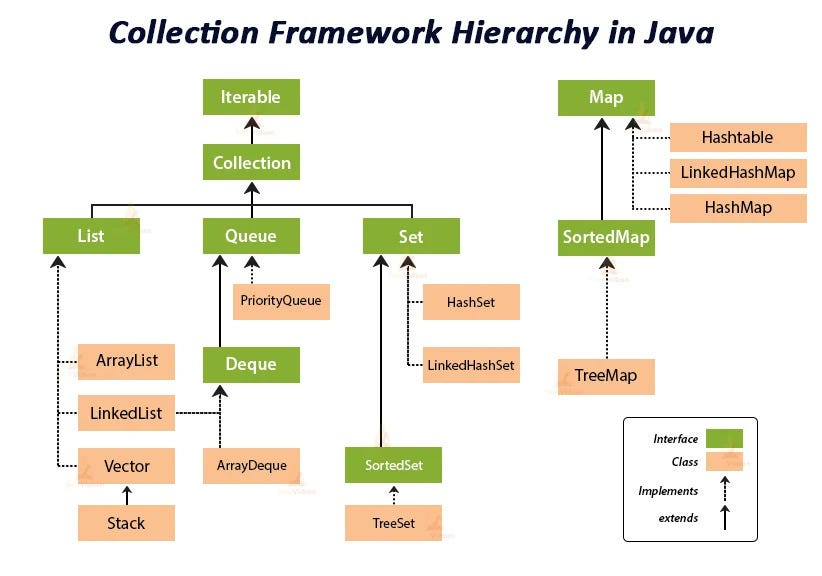

# 자료형과 WrapperClass, 컬렉션 프레임워크 (List, Set, Map, Queue)

## 자료형

### 정수 자료형

* byte
* short
* int
* long

각각 1, 2, 4, 8 byte의 크기를 가진다. 또한, 다른 운영체제와 달리 int와 long의 크기는 고정되어 있다.

### 실수 자료형

* float
* double

각각 4, 8 byte의 크기를 가진다. float는 7자리, double은 15자리의 정밀도를 가진다.


### 문자 자료형

* char
* String

char는 2 byte의 크기를 가지며, 유니코드를 사용한다. String은 문자열을 저장하는 자료형이다. 그리고 String은 불변(immutable)하다. 즉, 한 번 생성된 문자열은 변경할 수 없다.
또한, String은 문자열을 저장하는 자료형이지만, 문자열을 저장하는 방법은 char 배열이다. (자바 9 부터는 상황에 따라서 byte 배열로 저장하기도 한다.)

### Reference 자료형

* Reference 자료형은 객체의 주소를 저장하는 자료형이다.
* Reference 자료형은 4 byte(객체의 주소 값)의 크기를 가진다.
* 기본 자료형과 다르게 Reference 자료형은 null 값을 가질 수 있다.


## WrapperClass

### WrapperClass란?

이럴 때에 기본 타입(primitive type)을 객체로 다루기 위해서 사용하는 클래스들을 래퍼 클래스(wrapper class)라고 한다. 

### 사용하는 이유

* 기본 자료형을 객체로 다루기 위해서 사용한다.
* ArrayList같이 Collection Framework에서 객체만 다룰 수 있는 경우에 사용한다.

### Boxing과 Unboxing

Boxing : 기본 타입의 데이터 → 래퍼 클래스의 인스턴스로 변환
UnBoxing : 래퍼 클래스의 인스턴스에 저장된 값 → 기본 타입의 데이터로 변환

또한, WrapperClass는 불변(immutable)하다. 즉, 한 번 생성된 WrapperClass는 변경할 수 없다. 고로 덧셈을 하면 새로운 객체를 생성하고 해당 객체로 주소를 변경해주는 것이다.

### Autoboxing과 AutoUnboxing

자바 5부터는 Boxing과 Unboxing을 자동으로 처리해주는 기능이 추가되었다. 이를 Autoboxing과 AutoUnboxing이라고 한다.

```java
Integer i = 10; // Autoboxing
int j = i; // AutoUnboxing
```

```java
Integer x = new Integer(1);
Integer y = 1;

System.out.println(x == y); // false
```

```java
Integer x = 1;
Integer y = 1;

System.out.println(x == y); // true (IntegerCache에 의해 1이란 객체가 저장이 되는 원리다)
```

위의 사례가 있긴 하지만... == 연산자를 사용하는 것은 좋지 않다. equals() 메소드를 사용하는 것이 좋다.

## 컬렉션 프레임워크 (Collection Framework)



* 자료구조를 구현해 놓은 클래스들을 제공하는 패키지
* Collection Interface와 Map Interface로 구성되어있다.
* 인터페이스와 다형성을 이용하여 객체지향적으로 구성되어 있다.


### List

* 저장 순서가 유지되는 컬렉션을 구현하는 데 사용
* 중복 허용
* 배열과 비슷한 구조

#### ArrayList

* 가장 많이 사용되는 List 컬렉션
* 배열과 비슷한 구조
* 크기가 자동으로 조절된다.
* 중간에 데이터를 추가하거나 삭제할 때는 뒤의 데이터를 복사하거나 이동해야 하므로 속도가 느리다.

#### LinkedList

* 노드와 노드의 주소값을 가지고 있는 구조
* 데이터의 삽입과 삭제가 빠르다.
* 데이터의 검색이 느리다.

### Set

* 중복을 허용하지 않는 컬렉션을 구현하는 데 사용
* 순서가 유지되지 않는다.
* HashSet, TreeSet, LinkedHashSet이 있다.

#### HashSet

* 가장 많이 사용되는 Set 컬렉션
* 키 순서를 유지하지 않는다.

#### TreeSet

* 키의 순서를 유지한다.
* 정렬된 순서로 데이터를 저장한다.

#### LinkedHashSet

* 데이터의 입력 순서를 유지한다.

### Map

* Key와 Value로 구성된 데이터를 저장하는 컬렉션
* Key는 중복을 허용하지 않고, Value는 중복을 허용한다.
* HashMap, TreeMap, LinkedHashMap이 있다.

#### HashMap

* 가장 많이 사용되는 Map 컬렉션
* Key의 순서가 유지되지 않는다.

#### TreeMap

* Key의 순서가 유지된다.
* Key를 기준으로 정렬된다.

### Queue

* FIFO(First In First Out) 구조
* 인터페이스로 구현되어 있다.
* LinkedList를 이용하여 구현할 수 있다.
* poll을 이용하여 데이터를 꺼내고, add를 이용하여 데이터를 넣는다. peek를 사용해 데이터를 확인할 수 있다.

#### PriorityQueue

* 우선순위 큐
* 우선순위가 높은 데이터가 먼저 나온다.

#### Deque

* 양방향 큐
* 인터페이스로 구현되어 있다.
* LinkedList를 구현체로 사용할 수 있다.
* addFirst, addLast, pollFirst, pollLast, peekFirst, peekLast를 사용할 수 있다.
* 코테 칠 때 많이 사용하면 좋다.


## 부록


### String
* 불변(immutable)한 객체
* 문자열 연산이 많은 경우에는 성능이 좋지 않다.
* 문자열 연산이 많은 경우에는 StringBuilder나 StringBuffer를 사용하는 것이 좋다.

### StringBuffer
* 가변(mutable)한 객체
* 문자열 연산이 많은 경우에 사용한다.
* 멀티 스레드 환경에서는 StringBuffer를 사용한다.

### StringBuilder
* 가변(mutable)한 객체
* 문자열 연산이 많은 경우에 사용한다.
* 단일 스레드 환경에서는 StringBuilder를 사용한다.

### new String()과 리터럴("")의 차이
* new String()은 새로운 객체를 생성한다.
* 리터럴("")은 String Pool에 있는 객체를 참조한다. 
* 리터럴("")은 String Pool에 있는 객체를 참조하기 때문에 같은 문자열을 가지고 있으면 같은 객체를 참조한다. 그래서 리터럴을 사용한 경우는 `==` 연산자를 이용하면 true를 반환한다.
* new String()은 새로운 객체를 생성하기 때문에 같은 문자열을 가지고 있어도 다른 객체를 참조한다.

#### StringPool이란?

* String Pool은 String 객체를 저장하는 풀이다.
* String Pool은 Heap 영역에 존재한다.
* 원래는 GC의 대상이 아니였으나 Java 7부터 GC의 대상이 되었다.


[String Literal](https://www.baeldung.com/java-string-pool)