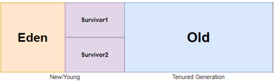

# 자바 메모리 영역 (Heap, Stack)

## Heap

* 힙 영역은 메서드 영역와 함께 모든 쓰레드가 공유하며, JVM이 관리하는 프로그램 상에서 데이터를 저장하기 위해 런타임 시 동적으로 할당하여 사용하는 영역이다.
* Reference Type의 객체들이 생성되는 공간이다.

### Young 영역

* 새로 생성된 객체들이 위치하는 곳이다.
* Eden 영역이 가득 차면 GC가 발생한다.
* 대부분의 객체가 금방 Unreachable 상태가 되기 때문에, 많은 객체가 Young 영역에 생성되었다가 사라진다.
* Young 영역에 대한 가비지 컬렉션(Garbage Collection)을 Minor GC라고 부른다.

### Old 영역

* Young영역에서 Reachable 상태를 유지하여 살아남은 객체가 복사되는 영역
* Young 영역보다 크게 할당되며, 영역의 크기가 큰 만큼 가비지는 적게 발생한다.
* Old 영역에 대한 가비지 컬렉션(Garbage Collection)을 Major GC 또는 Full GC라고 부른다
* Survivor 영역에서 일정 횟수 동안 살아남은 객체들이 Old 영역으로 이동한다.

### Eden 영역

* Young 영역에 있는 객체들 중 Reachable 상태를 유지하여 살아남은 객체들이 복사되는 영역
* GC에서 살아남은 객체들은 Survivor 영역으로 이동한다.

### Survivor 영역

* 최소 1번의 GC 이상 살아남은 객체가 존재하는 영역
* Survivor 영역에는 특별한 규칙이 있는데, Survivor 0 또는 Survivor 1 둘 중 하나에는 꼭 비어 있어야 하는 것이다.

### GC (Garbage Collection)

* GC는 더 이상 사용되지 않는 메모리를 해제하는 작업을 수행한다.

[링크](https://blog.bespinglobal.com/post/garbage-collection-1%EB%B6%80/)

[링크](https://blog.bespinglobal.com/post/garbage-collection-2%EB%B6%80/)

[링크](https://blog.leaphop.co.kr/blogs/42/G1GC_Garbage_Collector%EC%97%90_%EB%8C%80%ED%95%B4_%EC%95%8C%EC%95%84%EB%B3%B4%EA%B8%B0___1)

## Stack

* 메서드 호출 시 마다 각각의 스레드마다 생성되는 공간
* 메서드 정보, 지역 변수, 매개변수, 리턴 값 등이 저장된다.
* 메서드에서 객체를 생성하면 그 객체의 참조값이 스택에 저장된다.
* 각 스레드마다 생성된다.
* 메서드에서 사용하는 변수 중에서 기본 자료형(primitive type)은 스택 영역에 저장되며, 참조 자료형(reference type)은 힙 영역에 생성된 객체의 참조값(reference)이 저장된다.