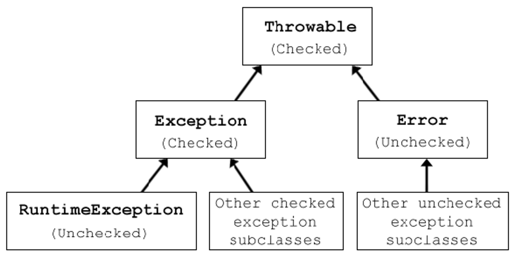

# Exception Handling (Checked vs Unchecked Exceptions, Try-Catch-Finally)

## Checked vs Unchecked Exceptions

### Checked Exceptions

- 컴파일러가 강제하는 예외처리
- `RuntimeException`을 상속하지 않은 예외
- `try-catch` 또는 `throws`로 예외처리를 해야 컴파일이 가능
- `IOException`, `SQLException` 등

### Unchecked Exceptions

- 컴파일러가 강제하지 않는 예외처리
- `RuntimeException`을 상속한 예외
- `try-catch` 또는 `throws`로 예외처리를 하지 않아도 컴파일이 가능
- `NullPointerException`, `ArrayIndexOutOfBoundsException` 등