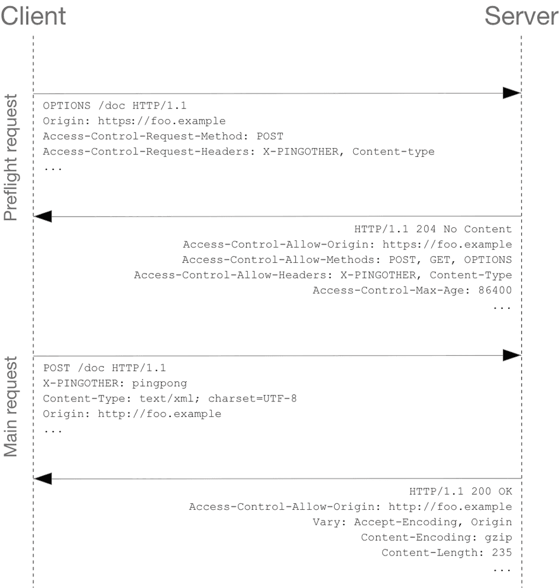

# CORS, SOP

## SOP(Same Origin Policy)

- SOP는 웹 브라우저의 동일 출처 정책을 말한다.
- 동일 출처 정책은 웹 브라우저에서 실행되는 스크립트가 다른 출처의 리소스와 상호작용하는 것을 제한하는 중요한 보안 방식이다.
- 이는 웹 애플리케이션의 보안을 위해 중요한 정책이다.
- 동일 출처 기준은 프로토콜, 호스트, 포트가 모두 같은 경우에만 동일 출처로 간주한다.

## CORS(Cross-Origin Resource Sharing)

request를 하는 경우

1. simple request

쉽게 얘기해서 get, head, post 3개의 요청중에

context type이 json은 안된다. 

고로… 토이프젝하면 거의 볼 수 없다.

1. preflight request

대다수를 차지

예비요청

- options 메서드를 사용 client가 서버에 origin과 메서드를 요청
- 응답으로 온 정보를 통해서 해당 요청이 유효한지 확인
- `Access-Control-Allow-Origin` 여기에 사이트 정보 담김

본 요청

- 잘 한다.