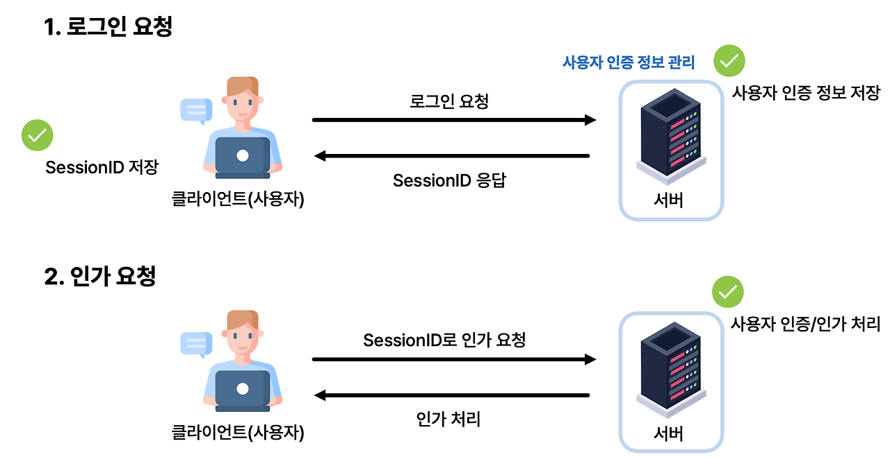
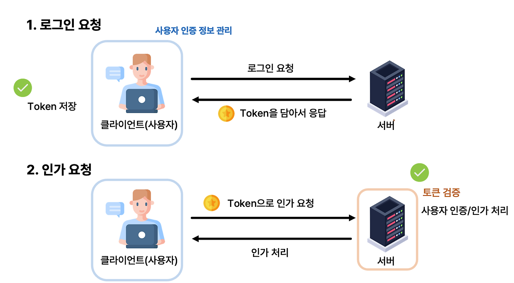

# 인증

## JWT vs 세션

### 세션

1. 클라이언트가 서버에 로그인 요청
2. 서버는 클라이언트에게 세션 ID를 발급하고 해당 세션 ID를 저장
3. 클라이언트는 세션 ID를 쿠키에 저장
4. 클라이언트가 서버에 요청을 보낼 때마다 쿠키에 저장된 세션 ID를 서버에 전달

#### 장점

1. 한 사용자의 디바이스별 인증을 관리할 수 있다.
  - PC로 접속 시 다른 기기(모바일, 태블릿 등)의 접근을 막을 수 있다.
  - 여러 디바이스에서 접속 중일 때 특정 디바이스의 유저를 로그아웃하게 할 수 있다. (인스타그램)
 
2. 하나의 계정 공유를 관리할 수 있다.
  - 넷플릭스처럼 계정 공유의 수도 제한할 수 있다.
  
3. 비정상적인 접근 신고가 들어오면, 서버에서 판단하여 해당 세션을 삭제해서 바로 로그아웃시킬 수 있다.

#### 단점

서버가 여러대 존재하면 세션이 생성된 서버와 요청을 보내는 서버가 다를 수 있다. 이 경우 세션 정보가 공유되지 않아 로그인이 풀릴 수 있다. 또한, 이렇게 되면 세션 정보를 공유하는 서버를 만들어야 하므로 서버의 부담이 커진다.

### JWT

1. 클라이언트가 서버에 로그인 요청
2. 서버는 클라이언트에게 JWT를 발급
3. 클라이언트는 JWT를 로컬 스토리지에 저장
4. 클라이언트가 서버에 요청을 보낼 때마다 JWT를 헤더에 담아 전달

#### 장점

1. 서버의 부담이 줄어든다.
  - 세션을 저장할 필요가 없어진다.
2. 서버가 여러대 존재해도 상관없다.
  - 결국 JWT의 유효성을 검증하는 것이기 때문에 서버가 여러대여도 상관없다.

#### 단점

1. 보안상 문제가 생길 수 있다.
    - 탈취 당해도 JWT는 계속 유효하기 때문에, 탈취 당했을 때의 대처가 중요하다.

## oauth 2.0

* 클라이언트: 사용자가 사용하는 서비스, 우리가 만든 **웹 서비스(우리가 만드는 백엔드도 다 포함)**
* 리소스오너: 해당 로그인을 하는 사용자(정보의 주인)
* 인가서버: 로그인을 하는 서버 access token을 제공 (표를 만들어주는 곳)
* 리소스서버: 정보를 제공하는 서버 access token을 검사해 리소스 제공(표 검사하는 곳)

### 인가 방식

1. Authorization Code Grant (바리바리 프로젝트에서 사용)
    * 가장 많이 사용되는 방식
    * 클라이언트가 인가서버에게 인가(Authorization) 코드를 요청
    * 인가 코드를 받은 클라이언트가 인가서버에게 access token을 요청
    * 인가서버는 access token을 클라이언트에게 발급
    * 클라이언트는 access token을 이용해 리소스 서버에게 정보를 요청
    * 리소스 서버는 access token을 검사하고 정보를 제공

2. Implicit Grant
   * 보안이 안될 때 사용하는 방식
   * Code Grant에서 인가 코드 대신 access token을 바로 발급
   
3. Resource Owner Password Credentials Grant
    * 자신의 서비스 내부에서만 사용
    * username, password를 직접 입력받아 access token을 발급

4. Client Credentials Grant (서강보드에서 사용)
   * 자격증명을 가진 클라이언트가 자신의 정보를 이용해 access token을 발급
   * 자격 증명을 클라이언트가 안전하게 저장할 수 있는 경우만 사용
   * 모바일 앱에서 사용

[Oauth2.0과 React 연동](https://deeplify.dev/back-end/spring/oauth2-social-login#%EC%8B%9C%ED%80%80%EC%8A%A4-%EC%84%A4%EB%AA%85)

[OAuth 2.0 구현하기](https://velog.io/@tank3a/%EC%86%8C%EC%85%9C-%EB%A1%9C%EA%B7%B8%EC%9D%B8-%EC%B2%98%EB%A6%AC)

[앱에서 OAuth 2.0 사용](https://velog.io/@blacklandbird/OAuth2-%EB%A1%9C%EA%B7%B8%EC%9D%B8#%ED%95%98%EC%A7%80%EB%A7%8C-%EC%9D%B4%EA%B1%B4-%EC%95%88%EB%90%9C%EB%8B%A4)

[Oauth 방식](https://blog.naver.com/mds_datasecurity/222182943542)