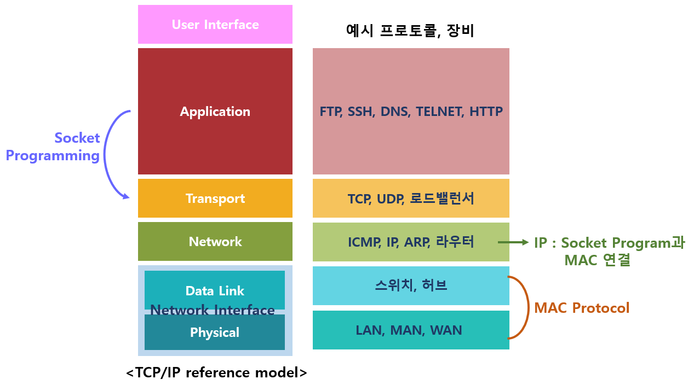

# TCP, UDP

## TCP/IP Model (Differences from OSI, Protocols)

TCP/IP 5계층
TCP/IP 5 계층은 네트워크의 기본 구조를 5개의 계층으로 나눠서 표준화한 것이다. 네트워크를 이용한 통신은 서로 다른 역할을 갖고 있는 5개의 계층을 통해 일어난다.

- OSI 계층과 다르게 7계층이 아닌 5계층으로 구성되어 있다. 4계층 이후 계층을 전부 Application 계층으로 통합했다.

## 패킷이란?

더 큰 데이터를 전송하기 위해 나눠진 작은 데이터 조각. 네트워크에서 데이터를 전송할 때, 데이터를 나눠서 전송하는데, 이때 나눠진 데이터 조각을 패킷이라고 한다.

## 소켓이란

TCP/IP 4계층에서 전송 계층 위에 놓임
주소와 프로세스 번호의 조합으로 연결의 종단점을 정의

## IPV4 vs IVP6

**IPv4 (Internet Protocol version 4)** 

IPv4는 3계층에서의 역할은 패킷을 라우팅하기 위해 IP 주소를 사용하여 목적지를 식별하는 것입니다. IPv4 헤더에는 송신 및 수신자 IP 주소, 패킷의 수명 등이 포함.

**IPv6 (Internet Protocol version 6)**

IPv6는 더 큰 주소 공간을 제공하고 보안 및 효율성을 향상시킨 버전으로, IPv4의 한계를 극복하기 위해 개발되었습니다. IPv6 헤더도 IPv4와 유사하지만, 더 많은 확장 기능을 지원.
