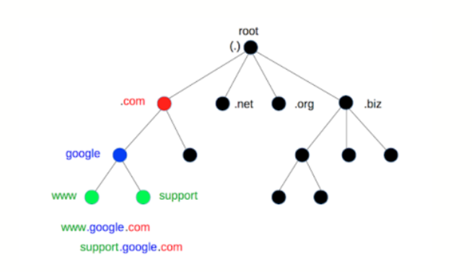
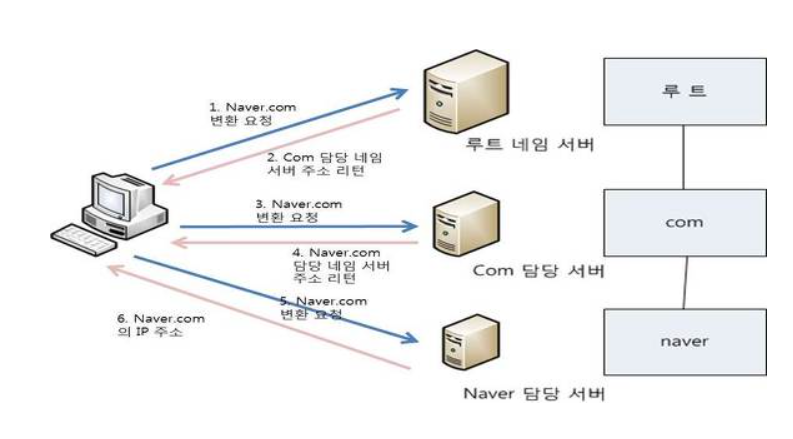
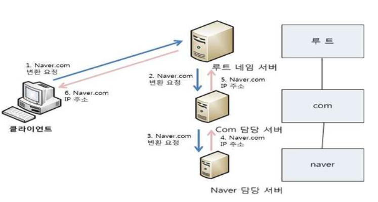
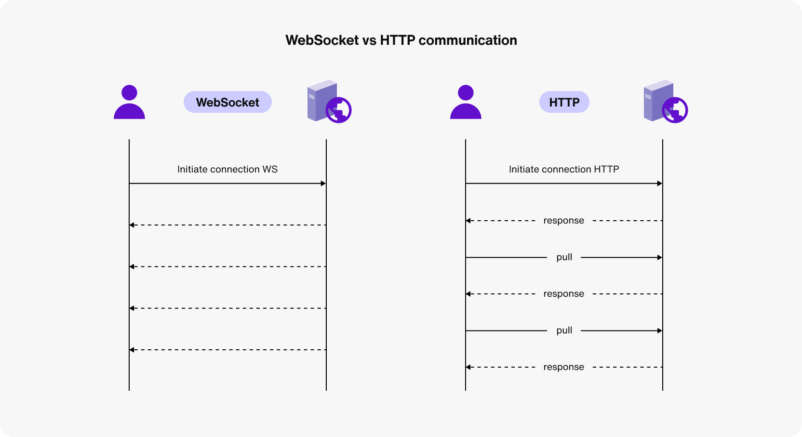

# 프로토콜 (민지)

## DNS

**DNS 서버 구조**

**1. 기지국 DNS 서버 (Local DNS server)**

- **Domain Name을 입력했을 때 해당 IP를 찾기위해 가장먼저 찾는 DNS서버**
- 보통 통신사의 DNS 서버로 등록되어 있음

**2. Root DNS Server**

- 최상의 DNS 서버
- 모든 DNS 서버들은 Root DNS server 주소를 기본적으로 갖고 있음
- Root DNS Server의 목록에도 해당 Domain Name의 IP가 없을 수 있음

**3. Top Level Domain**

- 최상위 도메인은 두 가지로 나뉨
    - 국가 코드 최상위 도메인 (Country Code Top-Level Domain, **ccTLD**) : (.kr, .jp, .CN, .US etc )
    - 일반 최상위 도메인 (generic top-level domain, **gTLD**) : (.com, .net, .org etc)

두가지 방식으로 서버를 찾는다.

### iterative

→ 클라이언트가 각각의 서버를 찾아가면서 물어본다.

### recursive

→ 서버를 거슬러서 타고 올라가면서 서버에 대한 정보를 물어본다.

실제로 서버를 찾을 때 다음과 같이 진행

1. 클라이언트는 로컬 네임 서버에 신호를 보낸다. (주로 통신사)
2. 로컬 네임서버에서 반복적으로 root name server, top level domain server 등에 질문을 해서 계속 신호를 보냄

## WebSockets (Real-Time Communication, Differences from HTTP)

### 생긴 이유

- HTTP는 클라이언트가 서버에 요청을 보내고 서버가 응답을 보내는 방식
- 이 방식은 클라이언트가 요청을 보내지 않으면 서버에서 클라이언트에게 정보를 보낼 수 없음
- 이 때문에 실시간으로 정보를 주고받기 어려움(또한, 3 way handshake를 계속 해야함)
- 이를 해결하기 위해 WebSockets가 등장
- 처음 요청시 Upgrade: websocket으로 요청을 보내면, 서버는 이를 받아들이고, 이후부터는 계속 연결을 유지하면서 정보를 주고받을 수 있음

#### 장점

- 양방향 통신 가능
- 실시간 정보 전송 가능

#### 단점

- 브라우저에 따라 지원이 다름(Websocket.io 등의 라이브러리를 사용하면 이를 해결할 수 있음)
- HTTP와 다르게 연결을 유지하고 있어야 하므로, 서버의 부담이 커질 수 있음

## ARP, ICMP, FTP, SSH

### ARP(Address Resolution Protocol)

- IP 주소를 MAC 주소로 변환하는 프로토콜
- 두가지 경우로 나뉨
  - 자신과 같은 네트워크에 있는 호스트의 MAC 주소를 알고 싶을 때
  - 다른 네트워크에 있는 호스트의 MAC 주소를 알고 싶을 때
- 같은 네트워크 상이라면 브로드캐스트로 MAC 주소를 요청
- 다른 네트워크 상이라면 라우터에게 MAC 주소를 요청. 라우터는 이를 받아서 다시 브로드캐스트로 MAC 주소를 요청. 그리고 라우터가 이를 받아서 다시 원래 기기에게 MAC 주소를 전달

### ICMP(Internet Control Message Protocol)

- 네트워크 장비들이 서로 통신 상태를 확인하기 위해 사용하는 프로토콜
- ping, traceroute 등의 명령어를 사용할 때 ICMP를 사용
- ICMP(Internet Control Message Protocol) 는 이와 같은 오류 정보를 발견해 송신측에 메시지를 전달하는 기능을 한다.

### IGMP(Internet Group Management Protocol)

- 멀티캐스트 그룹을 관리하기 위한 프로토콜
- 이런 방식은 Broadcast의 제한을 피해 한 호스트에서 여러 개의 목적지로 동시에 데이터를 보내야하는 응용 프로그램에 유용하다. IGMP(Internet Group Management Protocol)
