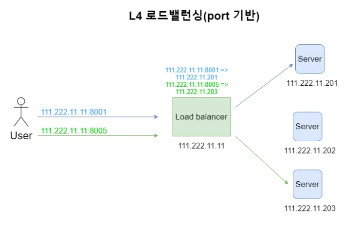
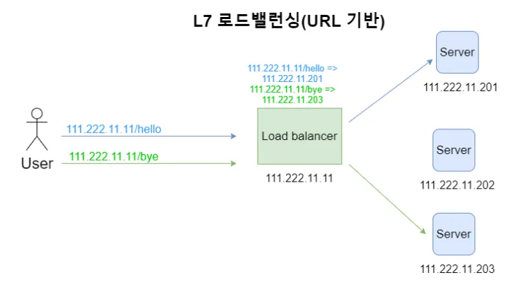
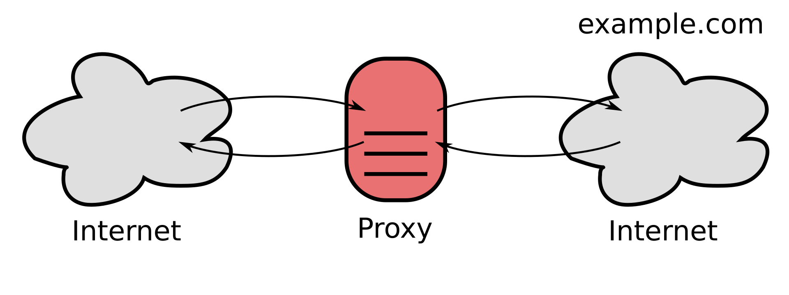
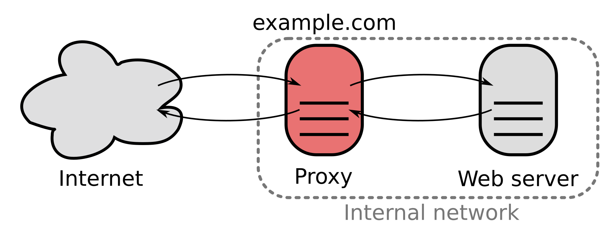

# 네트워크 인프라

## Load Balancer

로드 밸런싱이란 부하를 줄여준다는 의미로 서버 앞에 주로 역프록시 서버를 배치하고 부하를 줄이는 방식을 뜻한다.

**Load Balancer 종류**

L2 : Mac 주소를 바탕으로 Load Balancing 한다.

L3 : IP 주소를 바탕으로 Load Balancing 한다.

L4 : Transport Layer(IP & Port) Level에서 Load Balancing 한다.

**L7** : Application Layer(User Request) Level에서 Load Balancing 한다. (HTTP, HTTPS, FTP)

- URL 혹은 query param 등 어플리케이션 **요청하는 방법에 따라서** 어떤 서버로 로드밸런싱할지를 결정하는 것을 의미한다.

## CDN

따라서 서버를 분산시켜 캐싱해두고 사용자의 컨텐츠 요청이 들어오면 사용자와 가장 가까운 위치에 존재하는 서버로 매핑시켜 요청된 콘텐츠의 캐싱된 내용을 내어주는 방식으로 빠르게 데이터를 전송할 수 있게 된다. 단점은 캐싱된 데이터가 최신 데이터가 아닐 수 있다는 점이며 가격 또한 비싸다.

** 예시 **
- AWS CloudFront
- Google Cloud CDN
- CloudFlare

## ISP

인터넷 서비스 제공자로써 인터넷을 제공하는 회사를 말한다. KT, SKT, LG U+ 등이 있다.

## proxy, reverse proxy

프록시 서버는 클라이언트가 자신을 통해서 다른 네트워크 서비스에 간접적으로 점속할 수 있게 해주는 컴퓨터 시스템이나 응용 프로그램을 가리킨다.

## 장점

* 보안 : 클라이언트는 포워드 프록시를 통해서만 외부에 요청을 하기 때문에 클라이언트가 해당 서버 혹은 웹 사이트에 직접적으로 접근하는 것을 방지할 수 있다. 대표적인 예가 클라이언트가 특정 사이트에 접근할 수 없도록 막을 수 있는 기능이다.

* 캐싱 : 클라이언트가 요청을 할 경우, 포워드 프록시는 해당 요청을 캐싱하여 다른 클라이언트 혹은 동일한 요청이 들어올 경우 캐싱된 데이터를 전달해준다. 이렇게 되면 클라이언트는 캐싱된 데이터를 받아오기 때문에 서버에 부하를 줄일 수 있다.

* 암호화 : 클라이언트의 요청은 포워드 프록시 서버를 통과할 때 암호화 된다. 암호화 된 요청은 다른 서버를 통과할 때 필요한 최소한의 정보만 갖게 되는데, 이는 클라이언트의 ip를 숨길 수 있다는 장점이 있다. 요청을 받은 서버에서 ip를 역 추적해도 포워드 프록시 서버의 ip만 알 수 있게 된다.

Reverse Proxy의 장점

* 로드 밸런싱 : 서버의 트래픽이 몰리게 되면 하나의 서버로는 해당 요청을 감당하기 힘들어 지는 경우가 발생한다. 이럴 때 여러 대의 서버를 두고 요청을 분산시키는 것이 로드 밸런싱이다. 리버스 프록시는 여러 대의 서버에 분산시켜 요청을 보내게 된다. 이렇게 하면 서버의 부하를 분산시킬 수 있다.

* 보안 : 리버스 프록시는 웹 서버 앞에 놓이기 때문에 웹 서버에 직접 접근하는 것이 아닌 리버스 프록시를 통해 접근하게 된다. 이렇게 되면 웹 서버의 IP를 노출시키지 않을 수 있기 때문에 웹 서버에 대한 1차적인 공격을 막을 수 있다. (Proxy 서버의 IP만 노출)

* 캐싱 : 리버스 프로시 또한 프록시 서버에 캐싱되어 있는 데이터를 사용하여 클라이언트에 대한 요청을 처리할 수 있게 된다. (포워드 프록시 캐싱과 비슷한 기능이기도 하며 프록시 서버의 본래 기능이다.)

[참고](https://velog.io/@dev_leewoooo/Forward-Proxy-Reverse-Proxy%EC%97%90-%EA%B4%80%ED%95%98%EC%97%AC)