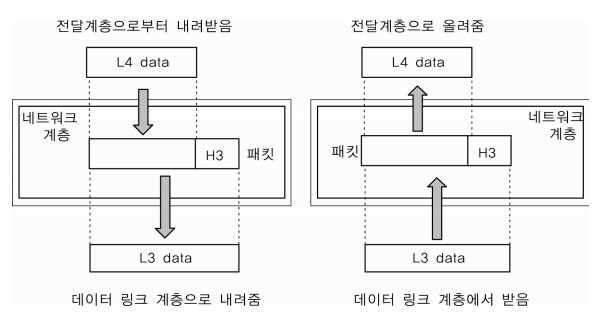

# 기타

## 웹 통신의 흐름([www.example.com을](http://www.example.com/) 입력했을 때)

### IP 주소를 얻기 위해 DNS 서버에 요청

* 처음으로 . DNS 서버에 com 정보를 가진 Name Server의 주소를 요청
* 그 다음으로 com 정보를 가진 Name Server에 example 정보를 가진 Name Server의 주소를 요청
* 최종적으로 Ip 주소를 얻는다.

### 연결

* 클라이언트가 서버에게 TCP 연결을 요청 (syn 패킷을 보냄)
* 서버는 클라이언트에게 응답 (ack과 syn 패킷을 보냄)
* 클라이언트는 ack를 서버에게 보내면서 연결을 완료
* 이제 클라이언트와 서버는 데이터를 주고 받을 수 있다.

### SSL Handshake

* 클라이언트가 서버에게 SSL 연결을 요청 자신이 사용할 수 있는 암호화 알고리즘 등의 정보를 보냄(Client Hello)
* 서버는 클라이언트에게 응답하여 사용할 암호화 알고리즘과 Certificate를 보냄(Server Hello)
* Certificate 안에는 서버의 공개키가 들어있음.(서버는 이 Certificate를 미리 브라우저를 통해 등록한 CA의 공개키를 이용하여 검증한다.)
* 클라이언트는 해당 Certificate를 검증하고, 서버의 공개키를 이용하여 대칭키를 암호화하여 서버에게 보냄
* 서버는 자신의 개인키로 해당 대칭키를 복호화하여 클라이언트와 대칭키를 공유
* 통신 시작!

## OSI Model Layers (7 Layers, Functionality)

### PDU (Protocol Data Unit)? 

* PDU(Process Data Unit) 란 각 계층에서 전송되는 단위를 말한다.
* PDU는 2 계층 - 프레임(Frame) / 3 계층 - tcp/ip 패킷(Packet), udp 데이터 그램(Datagram) / 4 계층 - 세그먼트(Segment)만

### 1계층 - 물리 계층(Physical Layer)

* 데이터를 전송하기 위한 물리적인 매체를 제공한다.
* 데이터를 전기적인 신호로 변환하여 주고 받는 역할을 한다.
*  즉, 기계어를 전기적 신호로 바꿔서 와이어에 실어주는 것이다.

### 2계층 - 데이터 링크 계층(Data Link Layer)

* 기기간의 데이터 전송을 보장하기 위한 계층이다.
* 패킷을 프레임으로 변환하고, 1계층에 보내준다.
* MAC 주소를 이용하여 통신한다.
* 스위치가 이 계층에서 동작한다.
* CRC를 이용하여 에러를 검출한다. 
* Frame을 사용하여 통신한다.

### 3계층 - 네트워크 계층(Network Layer)

기기에서 데이터그램(Datagram)이 가는 경로를 설정해주는 역할을 한다.라우팅 알고리즘을 사용하여 최적의 경로를 선택하고 송신 측으로부터 수신 측으로 전송한다. 데이터 링크 계층(2 계층)이노드 대 노드 전달을 감독한다면, 네트워크 계층(3 계층)은 각 패킷이 목적지까지 성공적이고 효과적으로전달되도록 한다.

* 데이터를 목적지까지 전달하는 역할을 한다.
* 목적지까지 빠르고 안전하게 전달해 주는 것이 중요.
* 전송 단위 : 패킷(tcp/ip), 데이터그램(udp)
* 장비 : 라우터
* 프로토콜 : IP, ARP, ICMP

### 4계층 - 전송 계층(Transport Layer)

신뢰성있는 통신을 보장하는 것이 이 계층의 목표이며 패킷 전달이 유효한지 확인한다. 흐름제어, 혼잡제어를 수행

* 전송단위 : 세그먼트
* 장비 : 게이트웨이, L4 스위치
* 프로토콜 : TCP, UDP

#### TCP

* 대부분 TCP 사용
* 신뢰적인 전송 보장(패킷 손실, 중복, 순서 바뀜 등이 없도록 보장) - ACK 사용
* IP가 처리할 수 있도록 데이터를 여러 개의 패킷으로 나누고, 도착지에서 완전한 데이터로 패킷을 재조립
* 데이터 전송 단위 : 세그먼트

#### UDP

* 비연결성, 비신뢰성 서비스
* TCP와 다르게 패킷을 나누고 재조립하는 과정 없이, 수신지에서 제대로 받든 말든 상관하지 않고, 데이터를 보내기만 한다.  => 에러와 그에 따른 재전송, 대체는 애플리케이션에서 처리해야 한다.
* But 속도가 빠르다. => Real Time 서비스에 사용하면 좋다
* 데이터 전송 단위 : 블록 형태의 다이어그램

### 5계층 - 세션 계층(Session Layer)

... 여기부터는 별로 중요하지 않을 것 같음