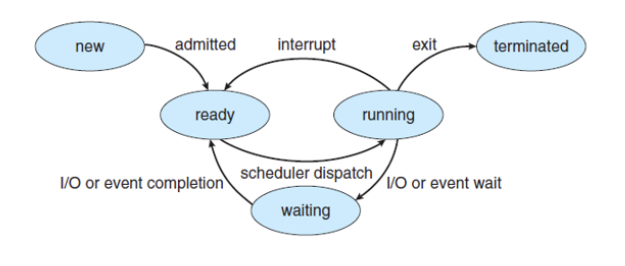

# Process vs Threads (Differences, Life Cycle, Context Switching)

## 프로세스 vs 스레드

프로세스는 컴퓨터에서 실행되는 프로그램을 말하며(메모리 상에 올라가있는 프로그램) 컴퓨터 작업의 단위

스레드는 프로세스 안의 여러 흐름을 얘기한다.

프로세스는 별도의 주소공간을 받지만, 스레드는 힙, 코드, 데이터를 받고 스택 부분은 다르게 되어있다.

스택 부분에는 함수가 있기 때문에 스택 부분을 다르게 해야 함수가 다르게 작동하는 것이 보장이 된다.

스레드는 스택 부분만 다르면 되기 때문에 context switching 비용이 낮다.

- 그러나 항상 멀티 프로세스보다 멀티스레드가 좋은 것은 아니다. 왜냐하면 멀티스레드의 경우 한 스레드의 문제가 발생하게 되면 다른 스레드에도 영향일 미치기 때문이다.
- 크롬의 경우에도 웹 브라우저 각각 사이트를 스레드로 사용하게 되면 보안성의 문제가 발생할 수 있기 때문에 창을 따로하면 각자의 프로세스로 관리한다.

## 프로세스 주소 공간

코드: 프로그램 코드가 들어가 있는 공간

스택: 지역변수, 매게변수, 리턴 값 등을 저장하고 함수가 종료되면 삭제 된다. 또한, 포인터를 움직이는 방식이므로 데이터 처리가 빠르다. LIFO방식이다.

힙: 동적 할당시 사용되는 영역이다. 단, 메모리 해제를 반드시 해야한다. 그렇지 않으면 메모리 누수가 난다.

데이터: 전역 변수, 스테틱 변수 같은 값들이 들어가 있는 공간

## 프로세스 생명주기

1. 프로세스 생성
2. 프로세스 준비
3. 프로세스 실행
4. 프로세스 대기
5. 프로세스 종료

## Context Switching

## PCB와 Context Switching

Process Control Block은 프로세스의 정보를 담고 있는 자료구조이다.

CPU가 프로세스가 여러 개일 때, CPU 스케줄링을 통해 관리하는데 이때, CPU는 각 프로세스들이 누군지 알아야 관리가 가능하다. 이러한 프로세스들의 특징을 갖고 있는 것이 바로 **Process Metadata**이고 PCB에 저장한다.