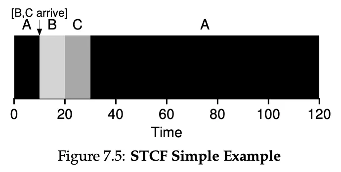

# CPU Scheduling Algorithms (Round Robin, Priority, SJF)

**스케쥴링의 평가기준**

- Turnaround Time
    
    task가 처음 시스템에 들어간 이후로 끝날 때 까지 시간을 의한다.
    
- Respose Time
    
    말 그대로 응답시간이라는 의미로 task가 처음 시스템에 들어간 이후로 처음으로 작동 되기 전까지의 시간을 의미한다. 즉 첫 응답까지의 시간이다.
    

이제 이 두가지 평가 기준으로 프로그램을 평가 하겠다.

**현재의 가정은 모든 task 는 I/O를 하지 않고 시스템은 해당 task 의 종료 시간을 알고 있다는 가정하에 진행한다.**

**FIFO**

First In, First Out 말 그대로 처음 들어간 task 가 처음 끝나는 방식이다. queue 자료구조를 생각하면 된다. 처음으로 시스템에 들어온 task가 제일 먼저 실행이 되고 끝날 때 까지 실행이 된다. 그러나 끔찍한 turn around time 과 response time을 가지고 있는데 아래의 예시를 참고하자

위의 그림과 같은 경우는 (A, B, C는 동시에 도착했다.)

- A의 turn around time은 10초 response time은 0초이다.
- B의 turn around time은 20초 response time은 10초이다.
- C의 turn around time은 30초 response time은 20초이다.

이런 케이스만 보면 별 이상이 없어 보이나 아래의 케이스에서는 좋지 않은 스케쥴링 방식임이 드러난다.(이전과 같이 task가 동시에 도착했다고 가정한다.)

- A의 turn around time은 100초 response time은 0초이다.
- B의 turn around time은 110초 response time은 100초이다.
- C의 turn around time은 120초 response time은 110초이다.

이런 케이스를 보면 실행시간이 긴 케이스 하나 때문에 다른 케이스들의 turn around time 과 response time이 안 좋아지는 현상이 나타났다. 이렇게 한 프로세스가 오래 실행이 되어서 뒤에오는 process의 turn around time 과 response time에 영향을 주는 현상을 convoy effect라고 한다.

**SJF (Shortest Job First)**

이러한 convoy effect 를 해결하는 방법으로 수행시간이 짧은 task 부터 실행하려한다. shortest job first 실행 할 때 당시에 도착한 task 중에서 시간이 제일 짧은 케이스를 실행시킨다. (7.3에서 task 는 0초에 동시에 도착했다고 가정한다.)

- A의 turnaround time 은 120초 response time은 20초이다.
- B의 turnaround time 은 10초 response time은 0초이다.
- C의 turnaround time 은 20초 response time은 10초이다.

이렇게 그림 7.2 에서 나온 케이스는 해결이 되었으나 7.4 같은 케이스면 아래와 같이 문제가 생긴다.

A만 0초에 도착하고 나머지 task는 10초에 도착했다.

- A의 turnaround time 은 100초 response time은 0초이다.
- B의 turnaround time 은 100초 response time은 90초이다.
- C의 turnaround time 은 110초 response time은 100초이다.

convoy effect를 막으려고 했지만 해당 케이스같이 시간이 오래 걸리는 작업이 먼저 도착하면 막을 수 없다.

**STCF (Shortest Time-to-Completion First)**

이러한 경우를 해결하기 위해서 shortest to completion first. 즉 수행 시간이 짧은 케이스와 종료 시간이 짧은 task를 우선적을 실행하는 개념이 나온다. 위의 스케쥴링과 차이점이라면 먼저 실행되는 작업이 있더라도 새로운 작업이 현재 실행되는 작업보다 먼저 끝나게 된다면 현재 작업을 중단하고 새로운 작업을 먼저 실행하는 차이점이 있다.

7.5의 케이스는 아까전의 7.4의 경우와 같이 A는 0초 B, C는 둘다 10초에 도착을 하는 경우를 나타냈다.

- A의 turnaround time 은 120초 response time은 0초이다.
- B의 turnaround time 은 10초 response time은 0초이다.
- C의 turnaround time 은 20초 response time은 10초이다.

이렇게 하면 아까전과는 다르게 turn around 타임이 전체적으로 줄어든 것을 알 수 있다. 또한 response time도 개선 되었다.

**RR**

위의 스케쥴링 방법들은 모두 turn around time 을 개선하기 위해서 스케쥴링을 개선했다. 하지만 요즘 컴퓨터에서는 여러가지 작업을 실행하는 이유 때문에, 처음 task를 받고 처음으로 실행하는 시간인 response time도 중요하다. 만약 STCF 의 케이스가 아래와 같이 실행된다고 가정하자

A B C 는 모두 0초에 도착했다고 가정한다.

A 의 response time 은 0초이고 B의 response time 은 5초이고 C의 response time은 10초이다. 여기서 문제인 것은 만약에 컴퓨터를 실행하는데 A의 실행 총 시간이 5초라고 해서 5초 동안 실행 시키게 되면 B와 C는 응답시간이 5초와 10초가 된다. 만약에 B와 C가 키보드나 마우스 입력이라면 컴퓨터를 지금과 같이 사용이 안되므로 다른 방법이 필요하다.

이러한 response time을 개선하기 위해서 나온게 round robin이다.

위의 stcf 와는 다르게 특정 단위로 시간을 쪼개서 A B C를 해당되는 시간 만큼만 실행시켜주는 방식이다.

- A의 response time 은 0초 turn around time 은 13초
- B의 response time 은 1초 turn around time 은 14초
- C의 response time 은 2초 turn around time 은 15초 이다.

이전 보다는 turn around time 이 악화 되었으나 response time 이 좋아졌다.

위의 방법들의 문제가 존재하는데, 바로 I/O작업이 발생하지 않는다고 가정을 하고 task를 설계하였다는 점이다.

위와 같이 I/O가 발생한 시점에서 I/O가 종료 될 때 까지 CPU를 그대로 놔두게 된다면 자원의 낭비가 심하므로

7.9의 그림과 같이 A의 I/O를 수행하는 동안은 B를 스케쥴에 포함 시켜서 작업을 수행한다. 그렇게 되면 더 짧은 시간에 두 작업을 완료하는 것이 가능하다.

**MLFQ**

위의 Round Robin 방식은 response time 은 좋으나 turn around time 은 끔찍하다는 단점을 지녔다. 이것을 어느정도 해소하기 위해서 MLFQ즉 Multilevel Feedback Queue를 사용해서 스케쥴링을 진행한다.

MLFQ는 다음과 같은 특징이 존재한다.

1. 여러 층의 queue 를 가지고 있다.
2. 각각의 queue는 우선순위가 존재한다.
3. 같은 층의 task는 round robin으로 작동하고 다른 층의 task는 층의 우선순위로 작동한다.

처음으로는 1 , 2, 3 번을 단순하게 따른 mlfq를 제현해 보겠다. 이 때 task 중에 I/O를 많이 쓰는 interactive task는 우선순위가 높게 지정된다.

이렇게 되면 문제점이 A와 B가 interactive 하나 총 cpu 시간을 많이 잡아먹게 된다면 아래에 있는 C와 D는 실행이 되지 않는다는 문제점이 존재한다. 이렇게 우선순위가 낮은 task가 cpu시간을 할당 받지 못하는 것을 starvation 이라고 부른다.

위의 starvation 을 막기위해서 새로운 규칙을 추가한다.

1. 새로운 task가 시스템에 들어오면 가장 높은 우선순위를 부여한다.
2. task가 주어진 slice 를 모두 사용하면 우선순위를 감소 시킨다.
3. task 가 주어진 slice를 모두 사용하기 전에 작업이 종료 된다면 우선순위를 유지한다.

그림 8.2, 8.3 같이 작업 시간이 오래될 수록 우선순위가 감소하는 것으로 보아 starvation 문제가 해결 된거 같아 보인다.

그러나 그림 8.5의 사례를 보자 B가 지속적으로 I/O를 불러서 우선순위에서 내려오지 않고 있다. 만약에 time slice가 10초인데 9.9초에 계속 I/O를 발생시키면 우선순위가 유지가 된다. 이를 악용해 스케쥴러를 속이는 것을 gaming이라고 표현한다.

이를 막기위해 새로운 규칙을 부여한다.

- 시스템에 들어온 일정 시간이 지나면 모든 작업이 우선순위가 가장 높게 이동한다.

이렇게 하면 아까전에 발생했던 starvation 문제는 해결이 되는거 같다. 하지만 여전히 B와 C는 우선순위가 감소 하지 않는 문제점이 존재한다.

이러한 상황을 해결해주기 위해 위에서 정의한 규칙을 바꾼다.

- time slice와 상관없이 task가 queue에서 정해진 시간을 다 쓰면 우선순위에서 내려온다. 이렇게 하면 time slice 전에 끊어서 우선순위에서 내려오지 않는 꼼수를 쓸 수가 없게 된다. 무조건 해당 시간을 보내면 queue에서 그림 8.6같이 우선 순위에서 내려오게된다.