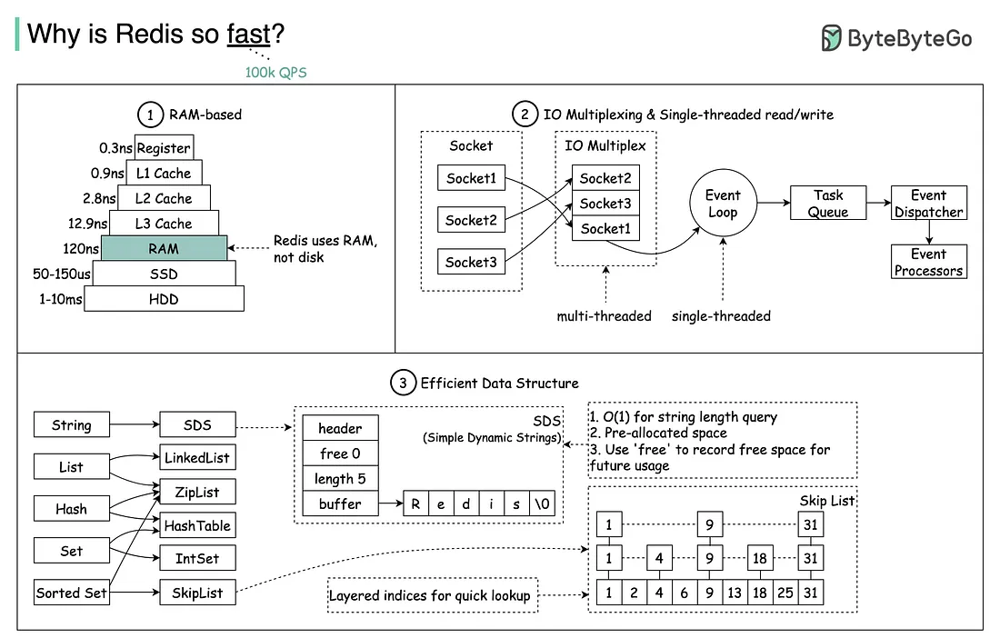

# Redis 아키텍처

## 1. Redis란?

- Redis(Remote Dictionary Server)는 오픈 소스 기반의 비관계형 데이터베이스 관리 시스템이다.
- 메모리 기반의 key-value 구조 데이터 관리 시스템으로, 영속성을 지원한다.

## 내부 구조



## RAM 활용

- Redis는 메모리 기반의 데이터베이스이다.
- 따라서, 데이터를 저장할 때 메모리를 사용한다.

## IO Multiplexing

- Redis는 IO Multiplexing을 사용하여 다수의 클라이언트 요청을 처리한다.
- 요청을 받은 후, 이벤트 루프를 통해 요청을 처리한다.


## 데이터 구조

- Redis는 효율적인 데이터 구조를 사용하여 데이터를 저장한다.

```c
struct redisObject {
    unsigned type:4;
    unsigned encoding:4;
    unsigned lru:LRU_BITS; /* LRU time (relative to global lru_clock) or
                            * LFU data (least significant 8 bits frequency
                            * and most significant 16 bits access time). */
    int refcount;
    void *ptr;
};
```

redis의 모든 데이터는 `redisObject` 구조체를 통해 관리된다. `type`은 데이터 타입을 나타내며, `encoding`은 데이터의 인코딩 방식을 나타낸다.


이렇게 단순히 int 타입으로 키를 저장해도, 레디스는 이를 `redisObject` 구조체로 감싸서 저장한다.

### SDS(Simple Dynamic String)

```c
struct __attribute__ ((__packed__)) sdshdr32 {
    uint32_t len; /* used */
    uint32_t alloc; /* excluding the header and null terminator */
    unsigned char flags; /* 3 lsb of type, 5 unused bits */
    char buf[];
};
```

C의 문자열은 null-terminated 문자열로, 문자열의 길이를 알기 위해서는 문자열을 순회해야 한다. 하지만, SDS는 문자열의 길이를 O(1)에 알 수 있다. 위의 코드는 SDS의 헤더 구조체로써 문자열의 길이와 할당된 메모리의 크기를 저장한다.

### Skip List

레디스는 Set 데이터 타입을 구현할 때, Skip List를 사용한다. Skip List는 다음과 같은 특징을 가진다.

가장 최하층은 모든 노드를 연결하는 연결 리스트이다. 그 위의 층은 아래 층의 노드 중 일부를 건너뛰어 연결한다. 이러한 구조를 통해 탐색 시간을 줄일 수 있다.

```
Level 3:  1 ----> 7 ----> 9
Level 2:  1 ----> 5 ----> 7 ----> 9
Level 1:  1 ----> 3 ----> 5 ----> 7 ----> 9
```
이렇게 구조가 있다면

위층부터
```
Level 3:  1 ----> 7 (넘김) 
```

```
Level 2:  1 ----> 5 ----> 7 (넘김)
```

```
Level 1:  1 ----> 3 ----> 5 ----> 6 ----> 7 ----> 9
```
이렇게 자신에 맞는 레벨을 찾아가면서 탐색을 한다.


```
Level 3:  1 ----> 7 ----> 9
Level 2:  1 ----> 5 ----> 7 ----> 9
Level 1:  1 ----> 3 ----> 5 ----> 6 ----> 7 ----> 9
```

Redis가 Skip 리스트를 선택한 이유는 주로 단순성과 성능 때문입니다. RB 트리나 B 트리와 같은 복잡한 트리 구조는 노드 삽입, 삭제 시 균형을 유지하기 위한 추가 연산이 필요합니다. 이와 달리 Skip 리스트는 구조가 간단하고, 랜덤 레벨링을 통해 **평균적인 O(log n)** 의 시간 복잡도를 달성할 수 있어 성능 면에서 트리와 비슷한 이점을 제공합니다.

Redis는 주로 메모리에서 동작하므로 복잡한 균형 트리 대신, 상대적으로 구현이 간단하고 효율적인 Skip 리스트를 사용하여 삽입, 삭제, 탐색 성능을 최적화하고자 했습니다.


[레디스 내부](ow-is-redis-made-why-is-redis-so-fast-3c5973caf313)

[레디스 문자열](https://dol9.tistory.com/204)

[스킵 리스트란?](https://ohgym.tistory.com/10)

[레디스 작동 구조](http://redisgate.jp/redis/server/redis_internal_flow.php)

[redis shared object](https://github.com/redis/redis/blob/unstable/src/server.h)

