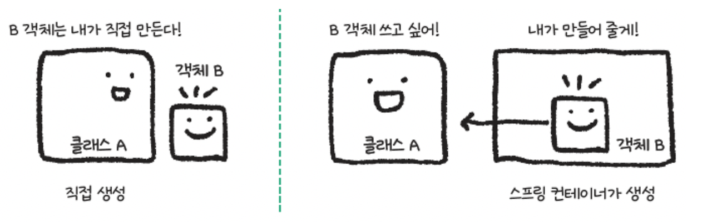
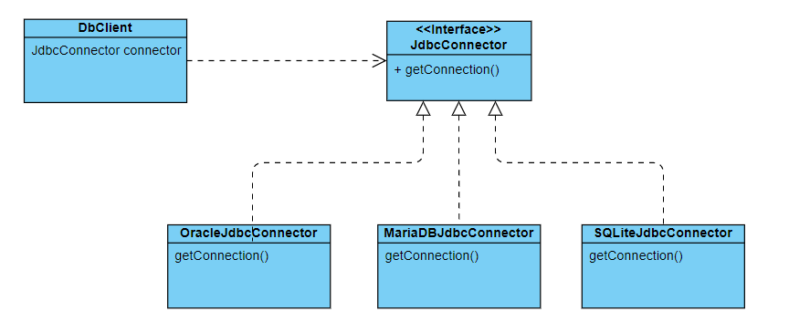

# DI/IOC, PSA

## DI(Dependency Injection)

Dependency Injection은 의존성 주입이라는 의미로 구체적인 클래스를 직접 지정하는 방식이 아닌 자신은 인터페이스만 알고 있고, 어떤 구현 객체가 필요한지는 외부에서 결정하는 방식이다.

DI를 적용하지 않은 경우
```java
public class Coffee {...}

public class Programmer {
	private Coffee coffee = new Coffee();

	public startProgramming(){
		this.coffee.drink()
	}
}
```

DI를 적용한 경우
```java
public class Coffee {...}
public class Cappuccino extends Coffee {...}
public class Americano extends Coffee {...}

public class Programmer {
	private Coffee coffee;

	public Programmer(Coffee coffee){
		this.coffee = coffee
	}

	public startProgramming(){
		this.coffee.drink()
	}
}
```


## IOC(Inversion of Control)

제어의 역전은 기존의 개발 방식에서 개발자가 직접 제어 흐름을 제어하는 것이 아니라, 외부의 프레임워크나 라이브러리가 제어 흐름을 대신하게 되는 것을 말한다.

스프링 같은 경우 IOC를 통해 객체의 생성, 생명주기의 관리를 유저가 아닌 스프링 컨테이너가 대신하게 된다.



## PSA(Portable Service Abstraction)



서비스 추상화(Service Abstraction)는 추상화의 개념을 애플리케이션에서 사용하는 서비스에 적용하는 기법이다.

구현에 상관없이 인터페이스만 맞춘다면 서비스를 제공한다는 의미다.


[출처](https://shinsunyoung.tistory.com/133)

[출처](https://ittrue.tistory.com/214)