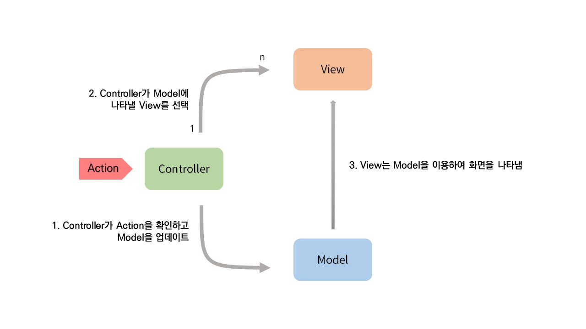
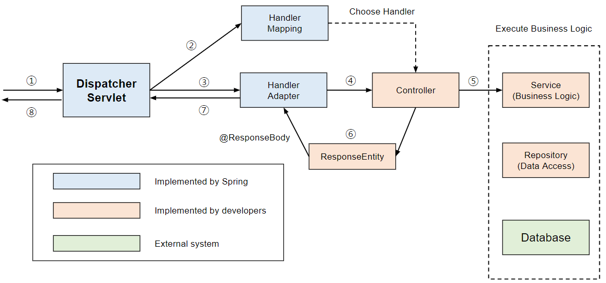
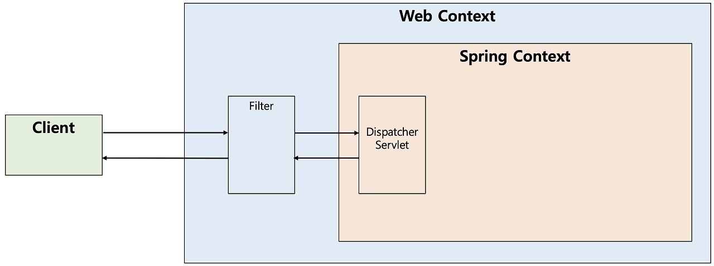
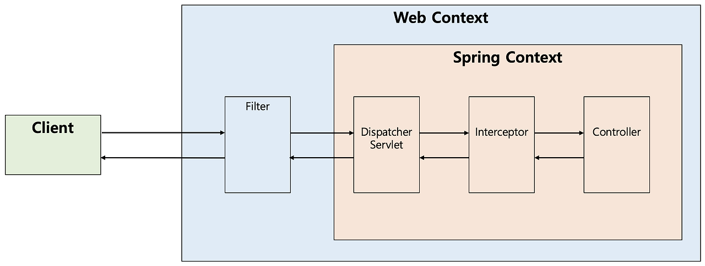
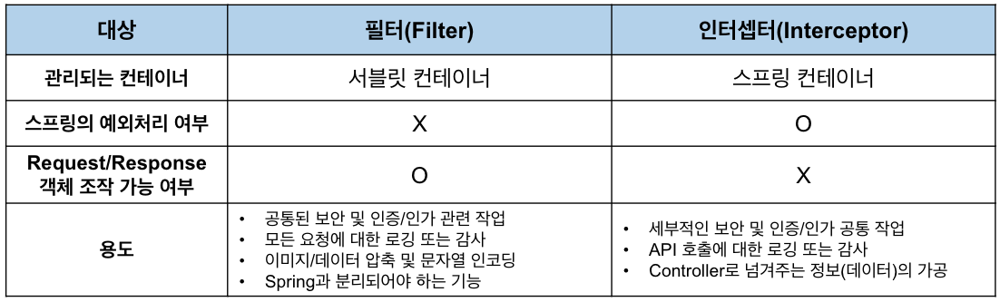

# MVC 아키텍처 (현우)

## MVC란?




* Model : 데이터를 담당하는 부분.
* View : 사용자에게 보이는 부분. 웹 페이지라고 생각하면 됨
* Controller : 스프링에서 Controller부분. View, 즉, 브라우저에서 요청이 들어오면 그 요청을 받아서 처리하는 부분.


### 장점
* 유지보수가 쉽다.
* 개발자들이 역할을 나눠서 개발할 수 있다.
  
### 단점
* 많은 View와 Controller가 서로 의존하면 복잡해질 수 있다.


## 스프링 MVC 처리 과정
[서블릿이란?](https://mangkyu.tistory.com/14)

[대략적인 구조](https://mangkyu.tistory.com/49)

[HandlerAdapter](https://velog.io/@suhongkim98/spring-MVC-%EC%83%9D%EB%AA%85%EC%A3%BC%EA%B8%B0
)



* Client는 URI 형식으로 웹 서비스에 요청을 보낸다.
* DispatcherServlet이 요청을 처리할 대상을 찾는다.
* HandlerAdapter을 통해 요청을 Controller로 위임한다.
* Controller는 요청을 처리한 후에 객체를 반환한다.
* 반환되는 객체는 Json으로 Serialize되어 사용자에게 반환된다.


## DispatcherServlet이란?

[링크](https://mangkyu.tistory.com/18)

HTTP 프로토콜로 들어오는 모든 요청을 가장 먼저 받아 적합한 컨트롤러에 위임해주는 프론트 컨트롤러(Front Controller)


### 코드로 보는 과정

`DispatcherServlet` 클래스에서


가 서블릿 실행시 실행됨


를 실행하고


를 부름


를 실행한 결과를 


우리가 주로 사용하는 `RequestMappingHandlerAdapter` (`AbstractHandlerMethodAdapter`를 상속)같은 경우 함수를 찾아서 `invokeHandlerMethod`에서 메서드를 실행하고 결과를 반환한다.


이렇게 `invokeHandlerMethod`에서 자신에게 설정된 `ArgumentResolver`도 설정해준다.

`invocableMethod.invokeAndHandle(webRequest, mavContainer, new Object[0])`;를 실행하면서 적용했던 `ArgumentResolver`가 내부에서 실행된다...(여기부터는 생략)


## 필터와 인터셉터
[출처](https://mangkyu.tistory.com/173)




### 필터

J2EE 표준 스펙 기능으로 디스패처 서블릿(Dispatcher Servlet)에 요청이 전달되기 전/후에 url 패턴에 맞는 모든 요청에 대해 부가작업을 처리할 수 있는 기능을 제공

```java
public interface Filter {

    public default void init(FilterConfig filterConfig) throws ServletException {}

    public void doFilter(ServletRequest request, ServletResponse response,
            FilterChain chain) throws IOException, ServletException;

    public default void destroy() {}
}
```

#### init 메소드
init 메소드는 필터 객체를 초기화하고 서비스에 추가하기 위한 메소드이다. 웹 컨테이너가 1회 init 메소드를 호출하여 필터 객체를 초기화하면 이후의 요청들은 doFilter를 통해 처리된다.
 
 
#### doFilter 메소드
doFilter 메소드는 url-pattern에 맞는 모든 HTTP 요청이 디스패처 서블릿으로 전달되기 전에 웹 컨테이너에 의해 실행되는 메소드이다. doFilter의 파라미터로는 FilterChain이 있는데, FilterChain의 doFilter 통해 다음 대상으로 요청을 전달하게 된다. chain.doFilter() 전/후에 우리가 필요한 처리 과정을 넣어줌으로써 원하는 처리를 진행할 수 있다.
 
 
#### destroy 메소드
destroy 메소드는 필터 객체를 서비스에서 제거하고 사용하는 자원을 반환하기 위한 메소드이다. 이는 웹 컨테이너에 의해 1번 호출되며 이후에는 이제 doFilter에 의해 처리되지 않는다.
 

### 인터셉터



```java
public interface HandlerInterceptor {

    default boolean preHandle(HttpServletRequest request, HttpServletResponse response, Object handler)
        throws Exception {
        
        return true;
    }

    default void postHandle(HttpServletRequest request, HttpServletResponse response, Object handler,
        @Nullable ModelAndView modelAndView) throws Exception {
    }

    default void afterCompletion(HttpServletRequest request, HttpServletResponse response, Object handler,
        @Nullable Exception ex) throws Exception {
    }
}
```

Spring이 제공하는 기술로써, 디스패처 서블릿(Dispatcher Servlet)이 컨트롤러를 호출하기 전과 후에 요청과 응답을 참조하거나 가공할 수 있는 기능을 제공한다. 즉, 웹 컨테이너(서블릿 컨테이너)에서 동작하는 필터와 달리 인터셉터는 스프링 컨텍스트에서 동작을 하는 것이다.
디스패처 서블릿은 핸들러 매핑을 통해 적절한 컨트롤러를 찾도록 요청하는데, 그 결과로 실행 체인(HandlerExecutionChain)을 돌려준다. 그래서 이 실행 체인은 1개 이상의 인터셉터가 등록되어 있다면 순차적으로 인터셉터들을 거쳐 컨트롤러가 실행되도록 하고, 인터셉터가 없다면 바로 컨트롤러를 실행한다.
인터셉터는 스프링 컨테이너 내에서 동작하므로 필터를 거쳐 프론트 컨트롤러인 디스패처 서블릿이 요청을 받은 이후에 동작하게 되는데, 이러한 호출 순서를 그림으로 표현하면 다음과 같다.

#### preHandle 메소드
* `preHandle` 메소드는 컨트롤러가 호출되기 전에 실행된다. 그렇기 때문에 컨트롤러 이전에 처리해야 하는 전처리 작업이나 요청 정보를 가공하거나 추가하는 경우에 사용할 수 있다.
* 이 때 handler는 컨트롤러에서 해당 요청을 처리하는 메소드를 의미한다.
* 반환값이 true이면 다음 단계로 진행이 되지만, false라면 작업을 중단하여 이후의 작업(다음 인터셉터 또는 컨트롤러)은 진행되지 않는다.
 
 
#### postHandle 메소드
* `postHandle` 메소드는 컨트롤러를 호출된 후에 실행된다. 그렇기 때문에 컨트롤러 이후에 처리해야 하는 후처리 작업이 있을 때 사용할 수 있다. 
* `modelAndView` 최근에는 Json 형태로 데이터를 제공하는 RestAPI 기반의 컨트롤러(@RestController)를 만들면서 자주 사용되지는 않는다.
* 또한 컨트롤러 하위 계층에서 작업을 진행하다가 중간에 예외가 발생하면 postHandle은 호출되지 않는다.
 
 
#### afterCompletion 메소드
afterCompletion 메소드는 이름 그대로 모든 뷰에서 최종 결과를 생성하는 일을 포함해 모든 작업이 완료된 후에 실행된다. 요청 처리 중에 사용한 리소스를 반환할 때 사용하기에 적합하다. postHandle과 달리 컨트롤러 하위 계층에서 작업을 진행하다가 중간에 예외가 발생하더라도 afterCompletion은 반드시 호출된다


### 차이점



* 필터는 Request와 Response를 조작할 수 있지만, 인터셉터는 조작할 수 없다.
* 아니면 스프링 안에서 필요한 작업이 있으면 Interceptor가 맞는거 같다.
  
## 프론트 컨트롤러를 쓰는 이유

* 공통 로직 처리
* 프론트 컨트롤러를 제외한 나머지 컨트롤러는 서블릿을 사용하지 않아도 된다

[출처](https://twojun-space.tistory.com/172)