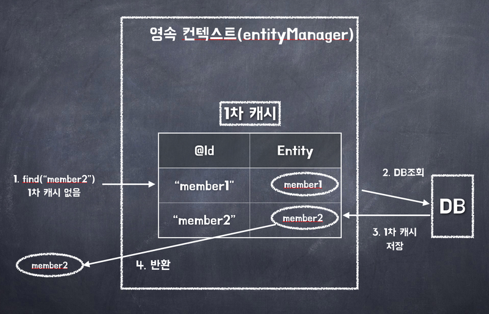

# JPA

Java Persistence API 라는 말로, 자바 ORM 기술에 대한 표준 명세이다. 주요 구현체는 Hibernate가 존재한다.

[링크](https://download.oracle.com/otn-pub/jcp/persistence-2_1-fr-eval-spec/JavaPersistence.pdf)

[참고](https://incheol-jung.gitbook.io/docs/q-and-a/spring/persistence-context)

## 영속성 컨텍스트

Server side와 Database 사이에 엔티티를 저장하는 논리적인 영역이라고 할 수 있다. 엔티티 매니저로 엔티티를 저장하거나 조회하면 엔티티 매니저는 영속성 컨텍스트에 엔티티를 보관하고 관리한다.

영속성 컨텍스트는 엔티티 매니저(Session)를 생성할 때 하나 만들어진다. 그리고 엔티티 매니저(Session)을 통해서 영속성 컨텍스트에 접근할 수 있고 영속성 컨텍스트를 관리할 수 있다.

주로 트랜색션 단위로 영속성 컨텍스트가 생성되고 종료된다.

### 엔티티의 생명주기

* 비영속(new/transient): 영속성 컨텍스트와 전혀 관계가 없는 상태
* 영속(managed): 영속성 컨텍스트에 저장된 상태
* 준영속(detached): 영속성 컨텍스트에 저장되었다가 분리된 상태
* 삭제(removed): 삭제된 상태

## 1차 캐시

* 영속성 컨텍스트 내부에 존재하는 캐시
* OSIV를 사용하더라도 사용자 요청이 들어올 때 부터 끝날 때 까지만 1차 캐시가 유효
* 같은 엔티티가 있으면 객체 동일성을 보장한다.
* Map 객체로 저장 : 엔티티를 식별자 값(@Id 맵핑)으로 구분한다. Key-value로 관리하는데 이때 key 값이 @Id 값이 된다.
* 식별자 값 필요 : 영속상태의 엔티티는 반드시 식별자 값이 있어야 한다.
* 쓰기 지연 : 영속성 컨텍스트는 트랜잭션 범위 안에서 동작한다. 그래서 트랜잭션이 끝나야 Commit이 이루어지고 반영된다.
* 변경 감지 : 엔티티의 변경사항을 감지하고 데이터베이스에 반영한다.

## 2차 캐시 

2차 캐시란 애플리케이션 범위에서 공유하는 캐시를 JPA에서는 공유 캐시(Shared Cache)라고 하며, 2차 캐시 (Second Level Cache, L2 Cache)라고 부르기도 한다.

* 영속성 컨텍스트는 엔티티가 필요하면 2차 캐시를 조회합니다.
* 2차 캐시에 엔티티가 없으면 데이터베이스를 조회합니다.
* 결과를 2차 캐시에 보관합니다.
* 2차 캐시는 자신이 보관하고 있는 엔티티를 복사해서 반환합니다.
* 2차 캐시에 저장되어 있는 엔티티를 조회하면 복사본을 만들어 반환합니다.
* 2차 캐시는 데이터베이스 기본 키를 기준으로 캐시하지만 영속성 컨텍스트가 다르면 객체 동일성 (a == b)을 보장하지 않습니다.
* Entity에 `@Cacheable`을 사용하면 2차 캐시를 사용할 수 있다.

## N+1 문제

* 연관관계 매핑시 발생하는 문제
* 연관관계 매핑시 fetch join을 사용하지 않으면 발생
* 쉽게 이야기하면, 부모 엔티티를 조회할 때 자식 엔티티를 조회하는 쿼리가 N번 발생하는 문제

## fetch join의 문제점

[단점-해결 됨](https://www.inflearn.com/community/questions/807577/spring-boot-3-x-distinct-%EA%B4%80%EB%A0%A8)

예전에는 다음과 같이 fetch join을 사용할 때 중복 데이터가 발생하는 문제가 있었지만, 최신 버전에서는 이 문제가 해결되었다.

[paging-join-fetch](https://tecoble.techcourse.co.kr/post/2020-10-21-jpa-fetch-join-paging/)

[paging-join-fetch-2](https://www.inflearn.com/community/questions/124237/fetch-join-outofmemory%EA%B2%BD%EC%9A%B0%EC%97%90-%EB%8C%80%ED%95%B4%EC%84%9C-%EC%A7%88%EB%AC%B8%EB%93%9C%EB%A6%BD%EB%8B%88%EB%8B%A4)

여전히 paging과 fetch join을 사용할 때 문제가 발생한다. paging을 하기 위해서 에플리케이션 메모리에 정보를 모두 들고 오기 때문에 Out of Memory가 발생할 수 있다.

[multibag-fetch-join](https://velog.io/@chlrjs132/MultipleBagFetchException-%EB%B0%9C%EC%83%9D-%EC%9B%90%EC%9D%B8%EA%B3%BC-%ED%95%B4%EA%B2%B0%EA%B3%BC%EC%A0%95)

set을 사용하거나 batch_size를 설정하면 해결할 수 있다.