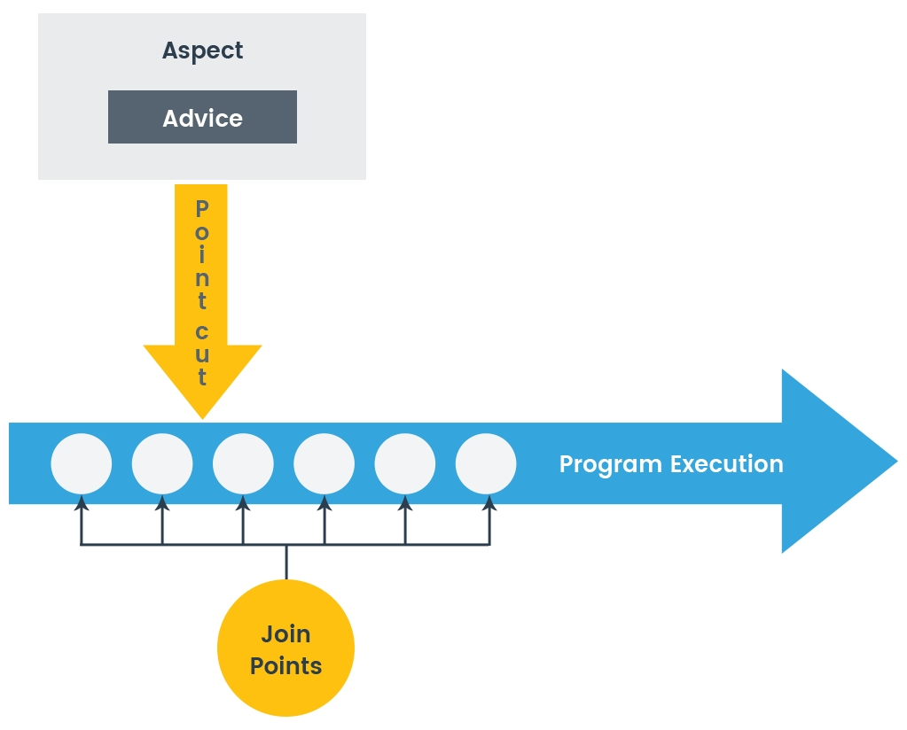

# AOP(Aspect-Oriented Programming)란?

## 위빙이란?

AOP에서 사용되는 용어로, **타겟 객체에 Aspect를 적용하는 과정**을 의미한다.

위빙은 크게 3가지 방법으로 이루어진다.

1. 컴파일 시점
2. 클래스 로딩 시점
3. 런타임 시점 -> Spring AOP에서 사용

## AOP 주요 용어

* Aspect : 여러 객체에 공통으로 적용되는 기능을 모듈화한 것, 어드바이스와 포인트컷을 합친 개념

* JoinPoint : 어드바이스가 적용될 수 있는 위치, 메소드 호출, 필드값 변경 등. 스프링은 런타임에 프록시를 이용해 메서드 조인포인트만 지원

* Advice : 조인포인트에서 실행되는 코드 즉 부가기능 그 자체. 또한, 에스팩트를 언제 코드 레벨에서 적용할지 결정

* Pointcut : 어떤 조인포인트에 어드바이스를 적용할지 결정하는 것. AspectJ 표현식을 사용해 어떤 메서드에 적용할지 결정

* Target: 어드바이스를 받을 대상 객체. 포인트 컷으로 결정함

* 

[출처](https://velog.io/@kai6666/Spring-Spring-AOP-%EA%B0%9C%EB%85%90)

[출처](https://velog.io/@dnjwm8612/AOP-Weaving-Proxy)

[출처](https://velog.io/@pi1199/Retention-%EC%97%90-%EB%8C%80%ED%95%B4)