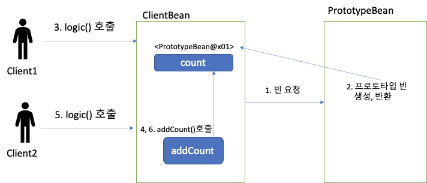
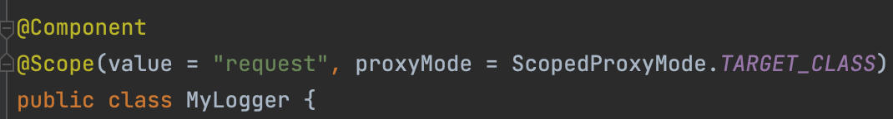

# Bean이란?

빈(Bean)은 스프링 컨테이너에 의해 관리되는 재사용 가능한 소프트웨어 컴포넌트이다. 즉, 스프링 컨테이너가 관리하는 자바 객체를 뜻하며, 하나 이상의 빈(Bean)을 관리한다.


## 빈 등록 방법

### Component Scanning

`@Component`, `@Service`, `@Repository`, `@Controller` 어노테이션을 사용하여 빈을 등록할 수 있다.

### Java Configuration

`@Configuration` 어노테이션을 사용하여 빈을 등록할 수 있다.

만약에 `@Configuration` 어노테이션을 사용하지 않고 `@Bean` 어노테이션을 사용하여 빈을 등록하면, 빈이 등록되지 않는다. 정확히는 싱글톤임을 보장해주지 않는다.

[참고](https://blogshine.tistory.com/551)

[참고](https://www.baeldung.com/configuration-properties-in-spring-boot)

[Configuration 없으면](https://easthshin.tistory.com/10)

## 빈 생성 순서

[빈 생성 순서](https://creampuffy.tistory.com/177)


`BeanDefinition` 등록한다.


## 빈의 Scope

`@Scope` 어노테이션을 사용하여 빈의 스코프를 지정할 수 있다.

`@Scope` 어노테이션의 속성은 다음과 같다.

* 싱글톤 : 디폴트 스코프. 스프링 컨테이너의 시작과 종료까지 유지되는 가장 넓은 범위의 스코프이다. 빈은 한번만 생성된다.

* 프로토타입 : 어러변 프로토타입 빈을 주입받는 싱글톤 빈과 달리 여러번 주입받을 때마다 새로운 프로토타입 빈이 생성된다.

* 웹 관련 스코프
  * request : 웹 요청이 들어오고 나갈 때까지 유지되는 스코프이다.
  * session : 웹 세션이 생성되고 종료될 때까지 유지되는 스코프이다.
  * application : 웹의 서블릿 컨텍스트와 같은 범위로 유지되는 스코프이다.

## 싱글톤과 프로토타입 동시 사용

싱글톤 객체에 프로토타입 빈을 넣게되면 



프로토타입은 빈을 호출 할 때 마다 새로운 객체를 반환하는 것을 목표로 한다. 하지만, 싱글톤 객체에 프로토타입 빈을 주입하게 되면 싱글톤 객체가 생성될 때 프로토타입 빈이 생성되고, 이후에는 프로토타입 빈이 생성되지 않는다. 이는 싱글톤 객체가 생성될 때 프로토타입 빈이 주입되기 때문이다. 

그러면 의도대로 프로토타입 빈이 생성되게 하려면 어떻게 해야할까?

### 프로토타입 스코프 - 싱글톤 빈과 함께 사용시 Provider로 문제 해결

```java
@Scope("singleton")
static class ClientBean {
    @Autowired
    private ApplicationContext ac;

    public int logic() {
        final PrototypeBean prototypeBean = ac.getBean(PrototypeBean.class);
        prototypeBean.addCount();
        return prototypeBean.getCount();
    }
}
```
하지만, 스프링에 종속적인 기술이기 때문에 피하는 것이 좋다. 기왕이면 자바 표준 기술을 사용하는 것이 좋다.


## ObjectFactory, ObjectProvider

```java
@Scope("singleton")
static class ClientBean {
    private final ObjectProvider<PrototypeBean> prototypeBeanProvider;

    public ClientBean(final ObjectProvider<PrototypeBean> prototypeBeanProvider) {
        this.prototypeBeanProvider = prototypeBeanProvider;
    }

    public int logic() {
        final PrototypeBean prototypeBean = prototypeBeanProvider.getObject();
        prototypeBean.addCount();
        return prototypeBean.getCount();
    }
}
```

아직은 스프링에 종속적이지만, javax에서 정의한 `ObjectFactory` 인터페이스의 확장으로 보인다.

### JSR-330 Provider

```java
@Scope("singleton")
static class ClientBean {
    private final Provider<PrototypeBean> prototypeBeanProvider;

    ClientBean(final Provider<PrototypeBean> prototypeBeanProvider) {
        this.prototypeBeanProvider = prototypeBeanProvider;
    }

    public int logic() {
        final PrototypeBean prototypeBean = prototypeBeanProvider.get();
        prototypeBean.addCount();
        return prototypeBean.getCount();
    }
}
```

* 자바 표준이므로 스프링이 아닌 다른 컨테이너에서도 사용할 수 있다.
* 딱 필요한 DL(Dependency Lookup) 기능만 제공한다.

### Request Scope 와 프록시 객체

주입된 빈이 호출마다 새로운 빈을 생성하게 하려면 프록시 객체를 사용하면 된다. (빈 스코프는 생성자의 개념이고 프록시는 호출의 개념이다.)



이렇게 프록시 객체를 사용하면 된다. 그렇게 되면 


이렇게 프록시 객체가 싱글톤 객체에 주입되고, 프로토타입 빈이 필요할 때마다 프록시 객체가 프로토타입 빈을 생성하게 된다.

entitymanager를 사용할 때도 이런 방식을 사용하는 것 같다.

Prototype과 차이라면 Prototype은 생성자가 불러올 때 범위라면 , Proxy는 객체에 주입되고, 프록시 객체로 설정한 객체가 호출 될 때 마다 새롭게 객체를 생성한다.


[스프링과 EntityManager의 동시성 비밀](https://woodcock.tistory.com/35)
[entity manager](https://www.inflearn.com/community/questions/158967/안녕하세요-entitymanager에-대해-궁금한-점이-있어-질문-남깁니다)


[참고](https://catsbi.oopy.io/b2de2693-fd8c-46e3-908a-188b3dd961f3)

[참고](https://mslim8803.tistory.com/70)

[참고](https://www.baeldung.com/whats-new-in-spring-4-3)