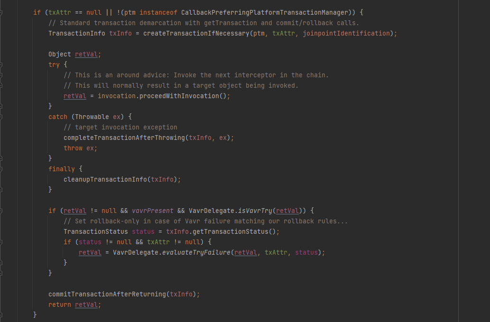

# @Transactional

## @Transactional 이란?

1. Connection 오브젝트를 특별한 저장소에 보관해두고,
2. 이후에 DAO의 메소드에서 트랜잭션이 필요할 때
3. 저장된 Connection을 가져다가 사용한다.

## TransactionSynchronizationManager

트랜잭션 동기화 저장소

* 작업 스레드마다 독립적으로 Connection 오브젝트를 저장하고 관리
* → 다중 사용자를 처리하는 서버의 멀티스레드 환경에서도 충돌 x

실제로 transactional을 사용하면 이런식으로 동작한다.

## 트랜잭션의 격리 수준 (Isolation Level)
DEFAULT :데이터 베이스에서 설정된 기본 격리 수준을 따른다.

READ_UNCOMMITED: 트랜잭션이 아직 커밋되지 않은 데이터를 읽을 수 있다.

READ_COMMITED: Commit 된 데이터만 읽을 수 있다.

REPEATABLE READ: 트랜잭션이 완료될 때까지 조회한 모든 데이터에 shared lock이 걸리므로 트랜잭션이 종료될 때까지 다른 트랜잭션은 그 영역에 해당하는 데이터를 수정할 수 없음.

SERIALIZABLE: 가장 엄격한 트랜잭션 격리수준으로, 완벽한 읽기 일관성 모드를 제공함. 

## 트랜잭션 전파 옵션

* REQUIRED : 이미 시작된 트랜잭션이 있으면 참여하고, 없으면 새로운 트랜잭션을 시작. (디폴트 속성)
* SUPPORTS : 이미 시작된 트랜잭션이 있으면 참여하고, 없으면 트랜잭션 없이 처리.
* REQUIRED_NEW : 항상 새로운 트랜잭션을 시작. 이미 진행중인 트랜잭션이 있다면 잠시 보류.
* MANDATORY : 이미 시작된 트랜잭션이 있으면 참여하고, 없으면 새로운 트랜색션을 시작하는 대신 예외를 발생. 혼자서는 독립적으로 수행되면 안되는 경우에 사용.
* NOT_SUPPORTED : 트랜잭션을 사용하지 않고 처리하도록 함. 이미 진행중인 트랜잭션이 있다면 잠시 보류시킴.
* NEVER : 트랜잭션을 사용하지 않도록 강제시킴. 이미 진행중인 트랜잭션 또한 허용하지 않으며, 있다면 예외를 발생시킴.
* NESTED : 이미 실행중인 트랜잭션이 있다면 중첩하여 트랜잭션을 진행합니다. 부모 트랜잭션은 중첩 트랜잭션에 영향을 주지만 중첩 트랜잭션은 부모 트랜잭션에 영향을 주지 않음.

## readOnly 옵션

* readOnly 속성을 통해 트랜잭션을 읽기 전용으로 설정할 수 있다.
* JPA의 경우, 해당 옵션을 true 로 설정하게 되면 트랜잭션이 커밋되어도 영속성 컨텍스트를 플러시하지 않는다. 플러시할 때 수행되는 엔티티의 스냅샷 비교 로직이 수행되지 않으므로 성능을 향상 시킬 수
있다.

[참고](https://velog.io/@betterfuture4/Spring-Transactional-%EC%B4%9D%EC%A0%95%EB%A6%AC)

[참고](https://velog.io/@e1psycongr00/Spring-Transactional%EA%B3%BC-entityManager-%EA%B4%80%EA%B3%84-%EB%B6%84%EC%84%9D%ED%95%98%EA%B8%B0)

[참고](https://www.baeldung.com/spring-jpa-flush)