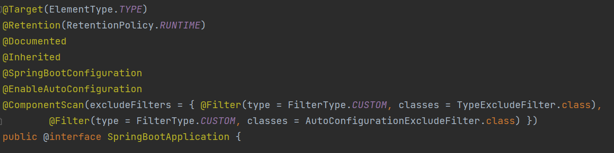

# Spring vs Spring Boot

[링크](https://velog.io/@brucehan/Spring-vs-Spring-Boot-%EC%B0%A8%EC%9D%B4%EC%A0%90-%EC%95%8C%EC%95%84%EB%B3%B4%EA%B8%B0)

[링크](https://www.baeldung.com/spring-vs-spring-boot)

Spring과 Spring Boot는 모두 Spring 프레임워크를 기반으로 한다. Spring은 Java EE를 기반으로 한 프레임워크로, Spring Boot는 Spring을 기반으로 한 프레임워크를 빠르게 만들기 위한 프레임워크이다.

## DI


기존 스프링
```xml
<dependency>
    <groupId>org.springframework</groupId>
    <artifactId>spring-web</artifactId>
    <version>5.3.5</version>
</dependency>
<dependency>
    <groupId>org.springframework</groupId>
    <artifactId>spring-webmvc</artifactId>
    <version>5.3.5</version>
</dependency>
```

스프링 부트 
```xml
<dependency>
    <groupId>org.springframework.boot</groupId>
    <artifactId>spring-boot-starter-web</artifactId>
    <version>2.4.4</version>
</dependency>
```

위에서 다른 라이브러리를 추가할 동안 starter하나면 설치하면 모든 종속성을 추가할 수 있다.


## Configuration 방식

Spring Framework의 경우에는 위 Dependency와 마찬가지로 설정할 때 짜야 할 코드가 길고, 관련 Annotation 및 Bean을 등록해야 합니다.

반면에, Spring Boot는 application.properties 파일이나 application.yml 파일에서 설정하면 끝입니다.

스프링에서 Thymeleaf를 사용할 때 설정하는 방법
```java
@Configuration
@EnableWebMvc
public class MvcWebConfig implements WebMvcConfigurer {

    @Autowired
    private ApplicationContext applicationContext;

    @Bean
    public SpringResourceTemplateResolver templateResolver() {
        SpringResourceTemplateResolver templateResolver = 
          new SpringResourceTemplateResolver();
        templateResolver.setApplicationContext(applicationContext);
        templateResolver.setPrefix("/WEB-INF/views/");
        templateResolver.setSuffix(".html");
        return templateResolver;
    }

    @Bean
    public SpringTemplateEngine templateEngine() {
        SpringTemplateEngine templateEngine = new SpringTemplateEngine();
        templateEngine.setTemplateResolver(templateResolver());
        templateEngine.setEnableSpringELCompiler(true);
        return templateEngine;
    }

    @Override
    public void configureViewResolvers(ViewResolverRegistry registry) {
        ThymeleafViewResolver resolver = new ThymeleafViewResolver();
        resolver.setTemplateEngine(templateEngine());
        registry.viewResolver(resolver);
    }
}
```

부트는?

```xml
<dependency>
    <groupId>org.springframework.boot</groupId>
    <artifactId>spring-boot-starter-thymeleaf</artifactId>
</dependency>
```

## Spring Boot의 강력한 Auto Configuration



`@ComponentScan`
이 어노테이션은 `@Component`, `@Controller`, `@Repository`, `@Service` 라는 어노테이션이 붙어있는 객체를 스캔해 자동으로 Bean에 등록합니다.

`@EnableAutoConfiguration`
이 어노테이션은 `@ComponentScan` 이후 미리 정의한 라이브러리들을 Bean에 등록.

미리 정의한 라이브러리들은 다음 경로에서 확인할 수 있음.

## Tomcat Embedded

Spring Boot는 내장된 Tomcat을 사용하여 서버를 실행할 수 있습니다. 일반 Spring에서는 별도의 Tomcat을 설치하고 설정해야 하지만, Spring Boot는 내장된 Tomcat을 사용하여 별도의 설정 없이 서버를 실행할 수 있음.

