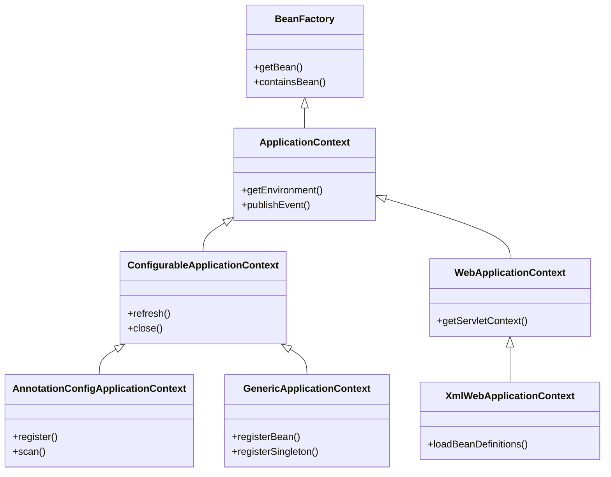

# IOC와 DI

### 1. IoC (Inversion of Control, 제어의 역전)
**객체 지향 프로그래밍에 필요한 객체의 생성, 관리, 의존성을 연결하는 책임을 개발자가 아닌 컨테이너가 관리하는 것**

#### 개념 설명:
- 전통적인 객체 지향 프로그래밍에서는 객체의 생성, 관리, 그리고 의존성을 연결하는 책임이 **개발자**에게 있습니다. 즉, 개발자가 객체를 명시적으로 생성하고, 객체가 필요로 하는 의존성을 직접 연결합니다.
	- 전통적인 애플리케이션에서는 객체가 필요할 때 스스로 다른 객체를 생성하거나 호출합니다.
- 하지만 IoC 패턴에서는 이러한 책임을 Spring과 같은 **컨테이너**가 대신 수행합니다. 개발자는 객체의 생명 주기나 의존성에 대한 제어를 직접 하지 않고, 그 제어를 Spring 컨테이너에 위임합니다.
- **제어의 역전(Inversion of Control)** 이라는 용어는 이와 같이 객체 생성 및 관리의 제어권이 역전되어, 개발자가 아닌 컨테이너가 객체의 생애 주기를 관리하는 방식을 의미합니다.

#### IoC의 이점:
- **결합도 감소**: 객체가 다른 객체를 스스로 생성하지 않고 외부에서 주입받으므로, 모듈 간의 결합도가 낮아집니다. 이로 인해 테스트와 유지보수가 용이해집니다.
- **유연성 증가**: Spring 컨테이너를 통해 객체 간의 의존성을 주입받기 때문에, 코드 수정 없이 다른 구현체로 쉽게 변경 가능합니다.

#### 참고: 
- 프레임워크는 IoC를 기반으로 서로 다른 계층의 컴포넌트를 조립하여 보다 유연한 애플리케이션 구조를 만들 수 있는 기능을 제공


### 2. DI (Dependency Injection, 의존성 주입)
DI는 IoC를 구현하는 한 가지 구체적인 방법입니다. 
- 객체가 필요로 하는 **의존성(Dependency)**을 외부에서 주입하는 방법론

#### 개념 설명:
- DI는 **IoC의 구현 방법** 중 하나로, 객체가 다른 객체에 의존하고 있을 때, 이 의존 객체를 개발자가 직접 생성하는 것이 아니라, **외부에서 주입받는 방식**입니다. 주입 방법에는 여러 가지 방식이 있으며, 그 중에서 가장 일반적인 방식은 **생성자 주입**, **Setter 주입**, **필드 주입**이 있습니다.

#### DI 주입 방식:
1. **생성자 주입**:
   - 생성자를 통해 의존성을 주입하는 방식입니다. Spring에서는 생성자가 한 개일 경우, `@Autowired` 애너테이션이 없어도 자동으로 주입됩니다.
   
   **예시**:
   ```java
   @Component
   public class ServiceA {
       private final ServiceB serviceB;

       // 생성자 주입
       @Autowired
       public ServiceA(ServiceB serviceB) {
           this.serviceB = serviceB;
       }
   }
   ```

2. **Setter 주입**:
   - Setter 메서드를 통해 의존성을 주입하는 방식입니다. 이 방식은 의존성 주입을 선택적으로 하거나, 애플리케이션의 실행 중간에 의존성을 변경하고자 할 때 유용합니다.

   **예시**:
   ```java
   @Component
   public class ServiceA {
       private ServiceB serviceB;

       // Setter 주입
       @Autowired
       public void setServiceB(ServiceB serviceB) {
           this.serviceB = serviceB;
       }
   }
   ```

3. **필드 주입**:
   - 필드에 직접 주입하는 방식입니다. 간단하고 직관적이지만, 테스트하기 어렵고 결합도가 높다는 단점이 있어 **권장되지 않는 방식**입니다.

   **예시**:
   ```java
   @Component
   public class ServiceA {
       @Autowired
       private ServiceB serviceB;
   }
   ```

#### DI의 이점:
- **유연성**: 객체가 필요한 의존성을 외부에서 주입받으므로, 코드 수정 없이 의존 객체를 다른 구현체로 바꿀 수 있습니다.
- **테스트 용이성**: 의존성을 외부에서 주입받으므로, 테스트할 때는 가짜 객체(mock)를 주입하여 테스트하기 쉽습니다.
- **명확한 의존성**: 객체가 어떤 의존성을 필요로 하는지 명확하게 드러내므로 코드의 가독성이 향상됩니다.

### IoC와 DI의 관계
- **IoC**는 더 넓은 개념으로, 애플리케이션의 제어 흐름을 개발자가 아닌 **컨테이너**가 담당한다는 개념입니다.
- **DI**는 IoC의 구체적인 구현 방법 중 하나로, 의존성을 외부에서 주입받는 방식입니다.
- 즉, DI는 IoC를 실현하기 위한 메커니즘 중 하나로, Spring에서 IoC는 DI를 통해 주로 구현됩니다.

### IoC Container (Bean Factory, ApplicationContext)
- Spring에서 IoC 컨테이너는 객체(Bean)의 생성, 관리, 의존성 주입을 담당하는 핵심 역할을 수행합니다. **ApplicationContext**나 **BeanFactory**가 Spring에서의 IoC 컨테이너 역할을 합니다.
  
  Spring의 IoC 컨테이너는 다음과 같은 작업을 수행합니다:
  - Bean 정의를 읽고 필요한 Bean을 생성합니다.
  - Bean 간의 의존성을 관리하고 주입합니다.
  - Bean의 생명 주기를 관리합니다.

1. **BeanFactory**
	- Spring에서 가장 기본적인 IoC 컨테이너 인터페이스입니다.
	- Bean의 생성, 의존성 주입, 생명주기 관리를 책임지며, 지연 로딩(lazy loading)을 지원합니다.
2. **ApplicationContext**
	- `BeanFactory`를 확장한 인터페이스로, Spring 애플리케이션에서 더 풍부한 기능을 제공합니다.
	- 국제화 메시지 처리, 이벤트 발행, AOP 및 트랜잭션 관리 등의 기능을 추가로 제공합니다.
	- 보통 `ApplicationContext`가 `BeanFactory`보다 많이 사용됩니다.
3. **ConfigurableApplicationContext**
	- `ApplicationContext`의 하위 인터페이스로, 애플리케이션 컨텍스트를 확장하고, 프로그램적 방법으로 컨텍스트를 닫거나 새로 고칠 수 있습니다.
	- `refresh()`, `close()` 등의 메서드를 제공하여 컨테이너의 생명 주기를 직접 관리할 수 있습니다.
4. **WebApplicationContext**
	- 웹 애플리케이션에 특화된 `ApplicationContext`로, HTTP 요청과 같은 웹 환경에서 사용됩니다.
	- Spring MVC와 함께 사용됩니다.
5. **AnnotationConfigApplicationContext**
	- 자바 기반 설정을 위한 애플리케이션 컨텍스트로, 어노테이션을 사용하여 Bean을 등록합니다.
6. **GenericApplicationContext**
	- 일반적인 애플리케이션 컨텍스트로, XML이나 어노테이션 식으로 설정할 수 있으며, 매우 유연한 구조입니다.
7. **XmlWebApplicationContext**
	- XML 설정 파일을 사용하여 웹 애플리케이션 컨텍스트를 구성하는 클래스입니다.



### 간단한 IoC 및 DI 예시

#### 예시 코드 (DI를 활용한 Spring 기반 IoC):

```java
@Configuration
public class AppConfig {

    @Bean
    public ServiceA serviceA() {
        return new ServiceA(serviceB());
    }

    @Bean
    public ServiceB serviceB() {
        return new ServiceB();
    }
}
```

이 예시에서:
- `AppConfig`는 Spring이 사용할 **구성 클래스**로, Bean을 정의합니다.
- `ServiceA`는 `ServiceB`에 의존하며, Spring이 `serviceB()`를 호출하여 `ServiceB` 객체를 생성하고 이를 `ServiceA`에 주입합니다.
- `@Bean` 애너테이션은 Spring에게 이 메서드가 Bean 객체를 반환한다고 알려줍니다. **Spring이 제어권을 가지고** 의존성 주입을 처리하는 것입니다.


### 서비스 로케이터 패턴
IOC를 구현하는 방법 중 하나로, **필요한 객체를 찾아주는 중개자** 역할을 하며, 의존성을 관리합니다.
```java
class MovieLister {
    MovieFinder finder = ServiceLocator.movieFinder();
}
```
- **서비스 로케이터**: **클라이언트 클래스가 서비스 로케이터에 의존**하게 되지만, 필요한 서비스 객체를 명시적으로 요청할 수 있습니다.
	- 간단한 시스템에서는 **더 직관적**일 수 있지만, **결합도가 높아질 위험**이 있습니다.
- **의존성 주입**: 클라이언트 클래스는 서비스 로케이터에 의존하지 않으며, 컨테이너가 객체를 자동으로 주입해 줍니다.


# PSA (Portable Service Abstraction)

애플리케이션 개발 시 다양한 기술 스택과 환경에 구애받지 않고 일관성 있게 사용할 수 있는 추상화를 제공하는 것

#### 목적
- 기술과 환경의 차이에 상관없이 동일한 방식으로 서비스 계층에 접근할 수 있도록 해주는 것
	- 특정 플랫폼이나 구현체에 종속시키지 않고, 더 유연하고 이식성 있는 코드를 작성할 수 있습니다.

### PSA의 이점
1. **이식성(Portability)**: Spring의 PSA 덕분에 애플리케이션이 특정 기술 스택에 고정되지 않고, 다른 기술이나 서비스로 쉽게 전환될 수 있습니다.
2. **유연성(Flexibility)**: 추상화를 통해 다양한 환경에서 일관된 코드와 아키텍처를 유지할 수 있으며, 구현체에 대한 의존성을 줄일 수 있습니다.
3. **유지보수성(Maintainability)**: PSA는 구현체가 변경되더라도 최소한의 코드 변경만으로 애플리케이션을 유지보수할 수 있게 해줍니다.

#### Spring에서 제공하는 다양한 추상화 계층
1. **트랜잭션 관리**: Spring의 트랜잭션 추상화는 JDBC, JPA, Hibernate 등 다양한 데이터 접근 기술에서 동일한 방식으로 트랜잭션을 관리할 수 있게 합니다.
2. **메시징**: Spring은 메시징 시스템에 대한 추상화를 제공하여, JMS(Java Message Service)나 AMQP(Advanced Message Queuing Protocol)와 같은 메시징 기술을 일관된 방식으로 사용할 수 있습니다.
3. **데이터 접근**: Spring Data는 JPA, MongoDB, Cassandra 등 여러 데이터베이스에 대해 동일한 프로그래밍 모델을 사용할 수 있게 해줍니다.
4. **보안**: Spring Security는 다양한 인증 및 권한 부여 방식을 추상화하여, 세부적인 인증 시스템에 구애받지 않고 통합적인 보안 접근 방식을 제공합니다.


# References
- https://www.martinfowler.com/articles/injection.html